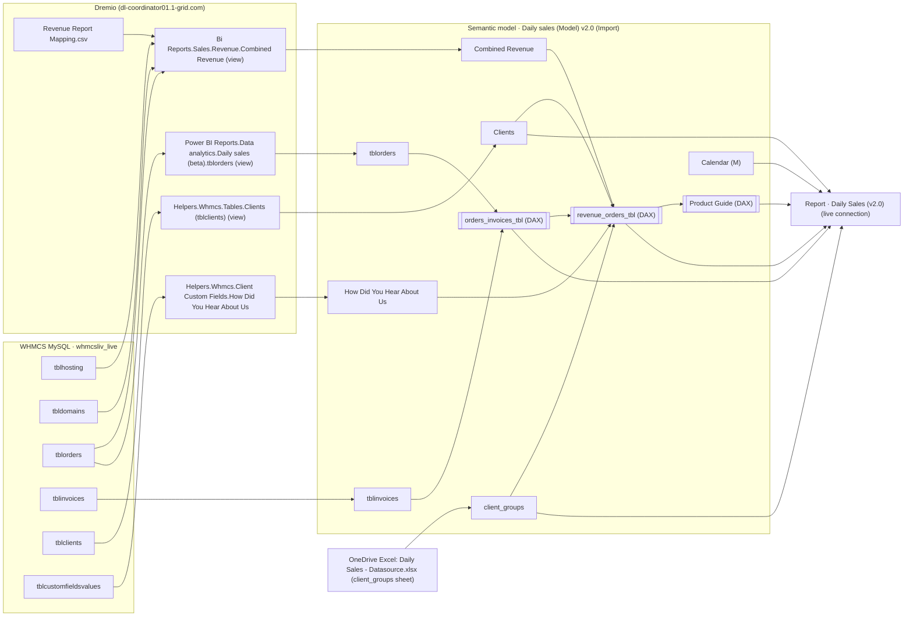
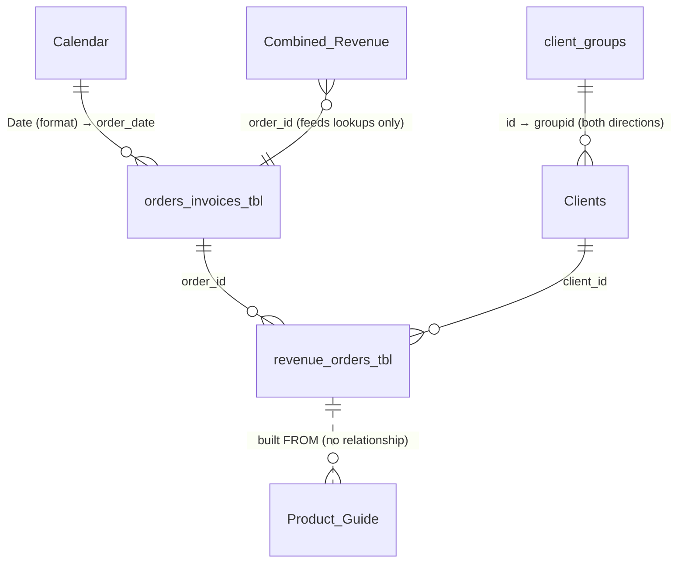

# Daily Sales (v2.0) — Semantic Model, Data & Report Documentation

> **Scope:** the *Daily sales (Model) v2.0* semantic model and the *Daily Sales (v2.0)* report in the **BigQuery Reports** Fabric workspace (1-grid).
> **Built from:** the model's full TMDL script and the report's PBIR definition (live-connected .pbix), both exported 6 Oct 2026, plus the Dremio SQL views in `Daily Sales/queries`.
> **Author:** Josh Stevenson (Nexora Web Agency) · generated 7 Oct 2026.

## Contents
1. At a glance
2. Architecture & data lineage
3. Data sources
4. Core data model (what the report uses)
5. Table reference — core tables
6. Business logic & key calculations
7. Measures (DAX)
8. Legacy & unused model objects
9. Report breakdown
10. Field usage matrix
11. Known issues & caveats
12. How to extend or change things
13. Appendices

## 1. At a glance

| Item | Value |
|---|---|
| Business | 1-grid — South African web hosting provider. Data is WHMCS billing data (orders, invoices, services, domains, clients). |
| Report | Daily Sales (v2.0) · report ID `7e523292-8e4d-4bf6-ae0b-fe57e7bb1a90` |
| Semantic model | Daily sales (Model) v2.0 · dataset ID `3647ff2a-d50e-4cfb-bf02-bed980609485` |
| Workspace | BigQuery Reports (Fabric / Power BI service) · workspace ID `70269500-c631-4ba1-a9f9-9fdf7461408f` |
| Connection | Report is **live-connected** to the model (XMLA). Model is **Import** mode with scheduled refresh through the on-premises gateway “BI Gateway Office”. |
| Primary source | WHMCS MySQL (`whmcsliv_live`) exposed through **Dremio** (`dl-coordinator01.1-grid.com:31010`). One SharePoint/OneDrive Excel file (client groups). |
| Model size | 32 user tables (59 hidden auto date tables on top), 503 columns (128 calculated), 12 measures, 28 relationships (+58 to auto date tables). |
| Tables the report touches | 6: `revenue_orders_tbl`, `orders_invoices_tbl`, `Calendar`, `Clients`, `client_groups`, `Product Guide` — these depend on 10 more upstream tables. |
| Report size | 10 pages (6 visible, 4 hidden: 1 drill-through, 3 tooltip), 169 visuals excl. shapes. |
| Currency / VAT | South African rand (R). WHMCS amounts include 15% VAT; all current report measures convert to **excl. VAT** via `vat_factor` (= subtotal ÷ total). |
| Culture | Model culture en-US; source query culture en-ZA. Fiscal year ends **June**. |
| Data window | Combined Revenue from 2021-01-01; orders/invoices (orders_invoices_tbl) from about Jul 2025; Calendar 2019-01-01 → end of current year. Report-level filter keeps the last 4 years. |

**Audiences** (from the report design brief): executives (is revenue on track?), sales & marketing (which products, customers and channels drive revenue?), finance (what is unpaid, cancelled or pending?), BI team (do the numbers reconcile to WHMCS?).

## 2. Architecture & data lineage



**How the numbers are produced (in one paragraph).** Dremio's *Combined Revenue* view lists every new service (tblhosting) and domain (tbldomains) registered since 2021 with its list price. *orders_invoices_tbl* is one row per WHMCS order with its invoice. The calculated table *revenue_orders_tbl* joins the two: one row per service on an order, carrying the order's invoice, plus one extra row for each order that has no service rows (labelled “Not in Combined Revenue”) so that product totals still add up to the invoice total. Each row receives a share of its invoice total (`invoice_total_alloc`, split by list price) and a VAT factor. The headline measures sum those shares for Paid invoices, excl. VAT, on the date the invoice was paid.

## 3. Data sources

| Model table | Source | Object | Notes |
|---|---|---|---|
| Combined Revenue | Dremio | Bi Reports.Sales.Revenue › Combined Revenue | M adds SSL/Company-reg lookups, cleans product_2, adds order_time. |
| Invoice detail | Dremio | Bi Reports.Sales › Invoice detail |  |
| Invoice Revenue (improved) | Dremio | Power BI Reports.Data analytics.Daily sales (beta) › Invoice Revenue (improved) daily sales beta |  |
| Mapping | Dremio | Power BI Files.power-bi.Mapping.Daily Sales › Mapping1.xlsx |  |
| Daily budget by order& traffic (FY21) | Dremio | Bi Reports.Sales › Sales Budget |  |
| Calculator | Dremio | Bi Reports.Sales.Helpers › Calculator |  |
| CI_invoicing_20210201 | Dremio | Bi Reports.Sales.Helpers › CI Invoicing 20210201 |  |
| Service Addons (tblhostingaddons) | Dremio | Helpers.Whmcs.Tables › Service Addons (tblhostingaddons) |  |
| Addons (tbladdons) | Dremio | Helpers.Whmcs.Tables › Addons (tbladdons) |  |
| tblorders | Dremio | Power BI Reports.Data analytics.Daily sales (beta) › tblorders |  |
| Calendar | Power Query (generated) | List.Dates 2019-01-01 → end of current year |  |
| Daily sessions - GA | Google Analytics (UA connector) | — |  |
| Hourly sessions - GA | Google Analytics (UA connector) | — |  |
| Conversion - GA | Google Analytics (UA connector) | — |  |
| Transaction IDs - GA | Google Analytics (UA connector) | — |  |
| Daily budget by order& traffic (FY22) | Dremio | Bi Reports.Sales › Sales Budget |  |
| tblactivityinvoicecreation | Dremio | Helpers.Whmcs.Activity Logs › Invoices Created |  |
| Order recurring amount | DAX calculated table | — |  |
| Clients | Dremio | Helpers.Whmcs.Tables › Clients (tblclients) |  |
| tblcustomfieldsvalues | Dremio | Whmcs DB.whmcsliv_live › tblcustomfieldsvalues |  |
| Customer age grouping | Dremio | Power BI Files.power-bi.Mapping › Customer Age Grouping.xlsx |  |
| tblinvoices | Dremio | Whmcs DB.whmcsliv_live › tblinvoices | Filtered to date > 2022-01-01 in M. |
| Combined_rev Summary 2 | DAX calculated table | — |  |
| How Did You Hear About Us | Dremio | Helpers.Whmcs.Client Custom Fields › How Did You Hear About Us |  |
| Max sales previous wk | DAX calculated table | — |  |
| Max sales previous wk1 | DAX calculated table | — |  |
| Combined_rev Summary 3 | DAX calculated table | — |  |
| orders_invoices_tbl | DAX calculated table | — |  |
| revenue_orders_tbl | DAX calculated table | — |  |
| Level Of Detail | DAX calculated table | — |  |
| Product Guide | DAX calculated table | — |  |
| client_groups | Excel on OneDrive (data_analyst@1-grid.com) | Daily Sales - Datasource.xlsx › client_groups |  |

Gateway / connection details: Dremio via ODBC/Arrow Flight on port 31010 through the on-premises gateway; the Excel source is a personal OneDrive path (`/personal/data_analyst_1-grid_com/...`) — a single point of failure if that account changes.

### 3.1 Dremio view: Combined Revenue (`Bi Reports.Sales.Revenue."Combined Revenue"`)

Source SQL is saved as `Daily Sales/queries/dremio_views/combined_revenue_expanded.sql`. Key logic:

- **Services branch** — `tblhosting` ⟶ `tblproducts` ⟶ `tblproductgroups` ⟶ `tblorders` ⟶ `tblpricing` (currency 1, type product) ⟶ mapping CSV on product name. `create_date` = `tblhosting.regdate`, from 2021-01-01. Orders 226506, 229377, 231737 excluded.
- **Domains branch** — `tbldomains` ⟶ `tblorders`; `service_group` = 'Domains', `service_type` = the TLD (text after the first dot), billing fixed to Annually / 12. Local TLDs use the first-payment amount, others the recurring amount.
- `recurring_amount` = first payment for active Company Registration, else `tblhosting.amount`. `billing_period` maps cycle → months. `revenue` = monthly-equivalent excl. VAT (except domain/SSL/IP types, which are full amount ÷ 1.15).
- `signup_agent`: IP 196.220.32.228 → **Agent**; admin_requestor_id 203 or IP 41.185.120.117 → **App Sale**; else **Online**.
- `product_1` / `product_2` defaults: VPS → Infrastructure Hosting, other services → Application Hosting, domains → Domain.

## 4. Core data model (what the report uses)



**Filter flow rule.** Filters flow *into* `revenue_orders_tbl` from Calendar (via orders_invoices_tbl), orders_invoices_tbl, Clients and client_groups — and never back out. Therefore:

- Every visual that must respond to product, customer, location or channel slicers has to use a **revenue_orders_tbl measure**.
- `orders_invoices_tbl` measures (`Paid Invoice Revenue`, `Paid Orders`) ignore product/customer slicers. Use them only for order-level reconciliation.
- Any filter on `orders_invoices_tbl` (e.g. the page filter `invoice_total > 0`) also removes revenue_orders_tbl rows whose order is not in orders_invoices_tbl (pre-Jul-2025 Combined Revenue rows).
- Calendar relates on **`Date (format)`**, not `Date`, because `Calendar[Date]` already has active relationships to legacy tables; using `Date` would create ambiguous paths.
- The *(Products)* measures remove the Calendar filter and re-apply the selected dates to `revenue_orders_tbl[Revenue Date]` (TREATAS), so paid revenue lands on the **paid date**, not the order date.

### 4.1 Relationships used by the report

| From (many) | To (one) | Cardinality | Cross-filter | Active |
|---|---|---|---|---|
| `tblorders.date` | `Calendar.Date` | * → 1 | Single | No |
| `'Combined Revenue'.create_date` | `Calendar.Date` | * → 1 | Single | No |
| `'Combined Revenue'.client_id` | `Clients.client_id` | * → 1 | Single | No |
| `'Combined Revenue'.order_id` | `tblorders.order_id` | * → 1 | Single | Yes |
| `tblorders.invoiceid` | `tblinvoices.id` | * → 1 | Single | Yes |
| `'Combined Revenue'.order_id` | `orders_invoices_tbl.order_id` | * → 1 | Single | Yes |
| `orders_invoices_tbl.order_date` | `Calendar.'Date (format)'` | * → 1 | Single | Yes |
| `revenue_orders_tbl.order_id` | `orders_invoices_tbl.order_id` | * → 1 | Single | Yes |
| `revenue_orders_tbl.client_id` | `Clients.client_id` | * → 1 | Single | Yes |
| `Clients.groupid` | `client_groups.id` | * → 1 | Both | Yes |

All other relationships (legacy tables, Google Analytics, budgets) are listed in Appendix A.

## 5. Table reference — core tables

### 5.1 revenue_orders_tbl  (DAX calculated table · main fact table)

**Grain:** one row per service/domain on an order (from Combined Revenue) + one row per order in orders_invoices_tbl that has no Combined Revenue rows. **Columns:** 55 (38 from the table expression, 17 calculated columns). **Hierarchy:** *Category Hierarchy* = Category › Sub Category › Product Name.

| Column | Type | Origin | Description |
|---|---|---|---|
| `order_id` | Int | Combined Revenue / orders_invoices_tbl | WHMCS order ID (tblorders.id). Key to orders_invoices_tbl. |
| `client_id` | Int | Combined Revenue / orders_invoices_tbl[order_userid] | WHMCS client ID. Key to Clients. |
| `service_id` | Int | Combined Revenue | tblhosting.id (services) or tbldomains.id (domains). Blank on "Not in Combined Revenue" rows. |
| `invoice_id` | Int | Combined Revenue / orders_invoices_tbl[order_invoiceid] | WHMCS invoice ID linked to the order. |
| `service_group` | Text | Combined Revenue | WHMCS product group (tblproductgroups.name), or "Domains". "Not in Combined Revenue" for orders with no service rows. |
| `service_type` | Text | Combined Revenue | WHMCS product name (tblproducts.name); for domains, the TLD (e.g. "co.za"). |
| `product_1` | Text | Combined Revenue | Legacy product family from the "Revenue Report Mapping.csv" mapping (e.g. Application Hosting, Infrastructure Hosting, Domain). |
| `product_2` | Text | Combined Revenue | Legacy product sub-family from the mapping, tidied in Power Query (e.g. Shared Hosting, SSL, Domain). |
| `base_or_addon` | Text | Combined Revenue | Base product vs add-on, from the mapping file. |
| `domain` | Text | Combined Revenue | Domain name attached to the service / domain registration. |
| `service_status` | Text | Combined Revenue | Current WHMCS service status (Active, Cancelled, Suspended, Pending, …). |
| `billing_cycle` | Text | Combined Revenue | WHMCS billing cycle (Monthly, Annually, Biennially, …). Domains are always "Annually". |
| `billing_period` | Int | Combined Revenue | Months in the billing cycle (1, 3, 6, 12, 24, 36). |
| `recurring_amount` | Decimal | Combined Revenue | List price incl. VAT (first payment for company registration / some domain TLDs). Used as allocation weight. |
| `setup_fee` | Decimal | Combined Revenue | Setup fee incl. VAT from tblpricing.msetupfee (0 for domains). Used as allocation weight. |
| `total_rev` | Decimal | Combined Revenue | Legacy list-price revenue excl. VAT (see Combined Revenue[total_rev] rules). NOT invoice revenue — do not mix with invoice-based measures. |
| `type_of_customer` | Text | Combined Revenue / derived | "New Customer" if the client signed up on the order/invoice date, "Existing Customer" otherwise, "Unknown Customer" when no sign-up date. |
| `customer_age_group` | Text | Combined Revenue | Person age band from the client custom field "Year of birth" (legacy; rarely filled). |
| `location` | Text | Combined Revenue | Client city (legacy copy of Clients[city]). |
| `signup_agent` | Text | Combined Revenue | Order channel from the SQL view: "Agent" (office IP 196.220.32.228), "App Sale" (admin 203 or IP 41.185.120.117), else "Online". |
| `heard_about_us` | Text | Combined Revenue | Client custom field "How did you hear about us"; "Did not say how" when empty. |
| `order_date` | Date | orders_invoices_tbl | Order date (time stripped). Blank for Combined Revenue rows whose order is not in orders_invoices_tbl (before ~Jul 2025). |
| `order_status` | Text | orders_invoices_tbl | WHMCS order status (Active, Pending, Cancelled, Fraud). |
| `order_amount` | Decimal | orders_invoices_tbl | Order total incl. VAT (tblorders.amount). |
| `order_paymethod` | Text | orders_invoices_tbl | Payment gateway chosen on the order. |
| `invoice_num` | Text | orders_invoices_tbl | Invoice number. |
| `invoice_date` | Date | orders_invoices_tbl | Invoice issue date. |
| `invoice_duedate` | Date | orders_invoices_tbl | Invoice due date. |
| `invoice_datepaid` | Date | orders_invoices_tbl | Invoice paid date (WHMCS stores 0000-00-00 when unpaid). |
| `invoice_status` | Text | orders_invoices_tbl | Paid, Unpaid, Cancelled, Refunded, Collections, Payment Pending, Draft. Blank when the order has no invoice in orders_invoices_tbl. |
| `invoice_paymethod` | Text | orders_invoices_tbl | Invoice payment gateway (e.g. mygateDebit, payfast, banktransfer). |
| `invoice_total` | Decimal | orders_invoices_tbl | Invoice total INCL. VAT. Repeated on every service row of the invoice — never SUM it directly. |
| `product_type` | Text | Calculated column | Five legacy product types (Domain, Company Registration, Infrastructure Hosting, Application Hosting, Web Services, else "Unmapped") from service_group. |
| `Status_Filter` | Text | Calculated column | invoice_status, with blank replaced by "Unpaid". |
| `Sub Category` | Text | Calculated column | Level 2 of the product hierarchy (13 values + fallback). See §6.3. |
| `Product Name` | Text | Calculated column | Level 3 of the product hierarchy: cleaned "<Product> – <Tier>" name. See §6.3. |
| `Category` | Text | Calculated column | Level 1 of the product hierarchy (6 values + fallback). See §6.3. |
| `Status_Group` | Text | Calculated column | "Paid" or "Cancelled & Unpaid" (everything not Paid, incl. no invoice). |
| `Unpaid_Cancelled_Rev` | Decimal | Calculated column | invoice_total when Status_Filter is Unpaid/Cancelled, else 0. Row-repeated: legacy helper, not used by visuals. |
| `Paid_Rev` | Decimal | Calculated column | invoice_total when not Unpaid/Cancelled, else 0. Row-repeated: legacy helper, not used by visuals. |
| `invoice_total_alloc` | Decimal | Calculated column | This row's share of invoice_total (incl. VAT), split by list price; rows of one invoice add up exactly to the invoice total. Basis of all product revenue measures. |
| `client_city` | Text | Clients | Client city. |
| `client_state` | Text | Clients | Client province / state (free text in WHMCS). |
| `client_country` | Text | Clients | Client country code (e.g. ZA). |
| `client_datecreated` | Date | Clients | Client account creation date. |
| `customer_tenure_group` | Text | Calculated column | Account age at order date (New, Under 1 year, 1–3, 3–5, 5–10, 10+ years, Unknown). Shown as "Customer Age" slicer. |
| `customer_tenure_sort` | Int | Calculated column | Sort key 1–6 (99 = Unknown) for customer_tenure_group. |
| `Client Group` | Text | Calculated column | WHMCS client group name via Clients[groupid] → client_groups; "No Group" when none. |
| `Sales Channel` | Text | Calculated column | "App" when signup_agent = "App Sale", otherwise "Website". |
| `Column` | ? | Calculated column (empty) | Placeholder with no expression — leftover; safe to delete after checking no report uses it. |
| `TLD` | Text | Calculated column | Domain extension from domain (".co.za" style for second-level .za, else last label). |
| `Domain Region` | Text | Calculated column | "Local" (.co.za, .net.za, .org.za, .web.za, .capetown, .durban, .joburg, .africa), "International", or "No Domain". |
| `vat_factor` | Decimal | Calculated column | invoice_subtotal ÷ invoice_total (share of the invoice that is revenue excl. VAT); 1/1.15 when no invoice or total 0. |
| `Column 3` | ? | Calculated column (empty) | Placeholder with no expression — leftover; safe to delete after checking no report uses it. |
| `Revenue Date` | Date | Calculated column | Date revenue is attributed to: invoice_datepaid for Paid invoices (if valid), otherwise order_date. Paid/Unpaid "(Products)" measures report on this date. |

<details><summary>Table expression (DAX)</summary>

```dax
-- One row per Combined Revenue row (service on an order), with that
-- order's order/invoice details from orders_invoices_tbl and the
-- client's location details from Clients added.
-- Matched on order_id. Order/invoice fields are blank where the order
-- isn't in orders_invoices_tbl (orders before ~Jul 2025).
-- PLUS one row per order in orders_invoices_tbl that has no Combined
-- Revenue rows, labelled "Not in Combined Revenue", so product visuals
-- add up to the full paid invoice total.
VAR existing_1 =
    SELECTCOLUMNS (
        'Combined Revenue',

        -- ---------- keys ----------
        "order_id",          'Combined Revenue'[order_id],
        "client_id",         'Combined Revenue'[client_id],
        "service_id",        'Combined Revenue'[service_id],
        "invoice_id",        'Combined Revenue'[invoice_id],

        -- ---------- service / product (Combined Revenue) ----------
        "service_group",     'Combined Revenue'[service_group],
        "service_type",      'Combined Revenue'[service_type],
        "product_1",         'Combined Revenue'[product_1],
        "product_2",         'Combined Revenue'[product_2],
        "base_or_addon",     'Combined Revenue'[base_or_addon],
        "domain",            'Combined Revenue'[domain],
        "service_status",    'Combined Revenue'[service_status],
        "billing_cycle",     'Combined Revenue'[billing_cycle],
        "billing_period",    'Combined Revenue'[billing_period],

        -- ---------- amounts (Combined Revenue) ----------
        "recurring_amount",  'Combined Revenue'[recurring_amount],
        "setup_fee",         'Combined Revenue'[setup_fee],
        "total_rev",         'Combined Revenue'[total_rev],

        -- ---------- customer (Combined Revenue) ----------
        "type_of_customer",  'Combined Revenue'[Type of customer] & " Customer",
        "customer_age_group",'Combined Revenue'[Customer age group],
        "location",          'Combined Revenue'[Location],
        "signup_agent",      'Combined Revenue'[signup_agent],
        "heard_about_us",    'Combined Revenue'[How Did You Hear ABt Us],

        -- ---------- client (Clients) ----------
        "client_city",
            LOOKUPVALUE ( Clients[city],        Clients[client_id], 'Combined Revenue'[client_id] ),
        "client_state",
            LOOKUPVALUE ( Clients[state],       Clients[client_id], 'Combined Revenue'[client_id] ),
        "client_country",
            LOOKUPVALUE ( Clients[country],     Clients[client_id], 'Combined Revenue'[client_id] ),
        "client_datecreated",
            LOOKUPVALUE ( Clients[datecreated], Clients[client_id], 'Combined Revenue'[client_id] ),

        -- ---------- order (orders_invoices_tbl) ----------
        "order_date",
            LOOKUPVALUE ( orders_invoices_tbl[order_date],
                          orders_invoices_tbl[order_id], 'Combined Revenue'[order_id] ),
        "order_status",
            LOOKUPVALUE ( orders_invoices_tbl[order_status],
                          orders_invoices_tbl[order_id], 'Combined Revenue'[order_id] ),
        "order_amount",
            LOOKUPVALUE ( orders_invoices_tbl[order_amount],
                          orders_invoices_tbl[order_id], 'Combined Revenue'[order_id] ),
        "order_paymethod",
            LOOKUPVALUE ( orders_invoices_tbl[order_paymethod],
                          orders_invoices_tbl[order_id], 'Combined Revenue'[order_id] ),

        -- ---------- invoice (orders_invoices_tbl) ----------
        "invoice_num",
            LOOKUPVALUE ( orders_invoices_tbl[invoice_num],
                          orders_invoices_tbl[order_id], 'Combined Revenue'[order_id] ),
        "invoice_date",
            LOOKUPVALUE ( orders_invoices_tbl[invoice_date],
                          orders_invoices_tbl[order_id], 'Combined Revenue'[order_id] ),
        "invoice_duedate",
            LOOKUPVALUE ( orders_invoices_tbl[invoice_duedate],
                          orders_invoices_tbl[order_id], 'Combined Revenue'[order_id] ),
        "invoice_datepaid",
            LOOKUPVALUE ( orders_invoices_tbl[invoice_datepaid],
                          orders_invoices_tbl[order_id], 'Combined Revenue'[order_id] ),
        "invoice_status",
            LOOKUPVALUE ( orders_invoices_tbl[invoice_status],
                          orders_invoices_tbl[order_id], 'Combined Revenue'[order_id] ),
        "invoice_paymethod",
            LOOKUPVALUE ( orders_invoices_tbl[invoice_paymethod],
                          orders_invoices_tbl[order_id], 'Combined Revenue'[order_id] ),
        "invoice_total",
            LOOKUPVALUE ( orders_invoices_tbl[invoice_total],
                          orders_invoices_tbl[order_id], 'Combined Revenue'[order_id] )
    )

-- Orders that exist in orders_invoices_tbl but have no Combined Revenue rows
VAR crOrders = DISTINCT ( 'Combined Revenue'[order_id] )
VAR missing =
    SELECTCOLUMNS (
        FILTER ( orders_invoices_tbl, NOT orders_invoices_tbl[order_id] IN crOrders ),

        -- ---------- keys ----------
        "order_id",          orders_invoices_tbl[order_id],
        "client_id",         orders_invoices_tbl[order_userid],
        "service_id",        BLANK (),
        "invoice_id",        orders_invoices_tbl[order_invoiceid],

        -- ---------- service / product (not available) ----------
        "service_group",     "Not in Combined Revenue",
        "service_type",      "Not in Combined Revenue",
        "product_1",         BLANK (),
        "product_2",         BLANK (),
        "base_or_addon",     BLANK (),
        "domain",            BLANK (),
        "service_status",    BLANK (),
        "billing_cycle",     BLANK (),
        "billing_period",    BLANK (),

        -- ---------- amounts (not available) ----------
        "recurring_amount",  BLANK (),
        "setup_fee",         BLANK (),
        "total_rev",         BLANK (),

        -- ---------- customer ----------
        -- New if the client signed up on the order date, otherwise Existing
        -- (same rule as Combined Revenue's Type of customer).
        "type_of_customer",
            VAR signup =
                LOOKUPVALUE ( Clients[datecreated], Clients[client_id], orders_invoices_tbl[order_userid] )
            RETURN
                SWITCH (
                    TRUE (),
                    ISBLANK ( signup ), "Unknown Customer",
                    INT ( signup ) = INT ( orders_invoices_tbl[order_date] ), "New Customer",
                    "Existing Customer"
                ),
        "customer_age_group",BLANK (),
        "location",          BLANK (),
        "signup_agent",      BLANK (),
        "heard_about_us",    BLANK (),

        -- ---------- client (Clients) ----------
        "client_city",
            LOOKUPVALUE ( Clients[city],        Clients[client_id], orders_invoices_tbl[order_userid] ),
        "client_state",
            LOOKUPVALUE ( Clients[state],       Clients[client_id], orders_invoices_tbl[order_userid] ),
        "client_country",
            LOOKUPVALUE ( Clients[country],     Clients[client_id], orders_invoices_tbl[order_userid] ),
        "client_datecreated",
            LOOKUPVALUE ( Clients[datecreated], Clients[client_id], orders_invoices_tbl[order_userid] ),

        -- ---------- order ----------
        "order_date",        orders_invoices_tbl[order_date],
        "order_status",      orders_invoices_tbl[order_status],
        "order_amount",      orders_invoices_tbl[order_amount],
        "order_paymethod",   orders_invoices_tbl[order_paymethod],

        -- ---------- invoice ----------
        "invoice_num",       orders_invoices_tbl[invoice_num],
        "invoice_date",      orders_invoices_tbl[invoice_date],
        "invoice_duedate",   orders_invoices_tbl[invoice_duedate],
        "invoice_datepaid",  orders_invoices_tbl[invoice_datepaid],
        "invoice_status",    orders_invoices_tbl[invoice_status],
        "invoice_paymethod", orders_invoices_tbl[invoice_paymethod],
        "invoice_total",     orders_invoices_tbl[invoice_total]
    )

RETURN
    -- UNION matches columns by position: both lists must stay in the same order
    UNION ( existing_1, missing )
```

</details>

**Calculated columns (DAX):**

`product_type`

```dax
-- Groups each service_group into one of the five product types
-- used in the "New revenue" breakdown.
SWITCH (
    revenue_orders_tbl[service_group],

    -- Domains
    "Domains",                          "Domain",

    -- Company registration
    "Company Registration",             "Company Registration",

    -- Servers and server add-ons
    "Business VPS Hosting",             "Infrastructure Hosting",
    "Virtual Private Servers",          "Infrastructure Hosting",
    "Dedicated Servers",                "Infrastructure Hosting",
    "Dedicated IP Addresses",           "Infrastructure Hosting",

    -- Shared hosting and hosted apps
    "Web Hosting",                      "Application Hosting",
    "WordPress Hosting",                "Application Hosting",
    "Reseller Hosting",                 "Application Hosting",
    "Business Email",                   "Application Hosting",
    "Website Builder",                  "Application Hosting",

    -- Services and add-ons
    "Do it For Me - Website Design",    "Web Services",
    "SSL Certificates",                 "Web Services",
    "Other",                            "Web Services",

    -- Anything new or unmapped
    "Unmapped"
)
```

`Status_Filter`

```dax
IF(ISBLANK(revenue_orders_tbl[invoice_status]),"Unpaid",revenue_orders_tbl[invoice_status])
```

`Status_Group`

```dax
IF(revenue_orders_tbl[Status_Filter]="Paid","Paid","Cancelled & Unpaid")
```

`Unpaid_Cancelled_Rev`

```dax
IF(revenue_orders_tbl[Status_Filter] IN { "Unpaid", "Cancelled" },revenue_orders_tbl[invoice_total],0)
```

`Paid_Rev`

```dax
IF(Not revenue_orders_tbl[Status_Filter]  IN { "Unpaid", "Cancelled" },revenue_orders_tbl[invoice_total],0)
```

`invoice_total_alloc`

```dax
-- This row's share of its invoice total.
-- Split by each product's list price (recurring + setup);
-- if every price on the invoice is 0, the total is split evenly.
-- Rows on the same invoice add up exactly to invoice_total.
VAR rowAmt =
    revenue_orders_tbl[recurring_amount] + revenue_orders_tbl[setup_fee]
VAR invAmt =
    CALCULATE (
        SUMX ( revenue_orders_tbl,
               revenue_orders_tbl[recurring_amount] + revenue_orders_tbl[setup_fee] ),
        ALLEXCEPT ( revenue_orders_tbl, revenue_orders_tbl[invoice_id] )
    )
VAR nRows =
    CALCULATE (
        COUNTROWS ( revenue_orders_tbl ),
        ALLEXCEPT ( revenue_orders_tbl, revenue_orders_tbl[invoice_id] )
    )
RETURN
    revenue_orders_tbl[invoice_total]
        * IF ( invAmt > 0, DIVIDE ( rowAmt, invAmt ), DIVIDE ( 1, nRows ) )
```

`customer_tenure_group`

```dax
-- How long the client had been with 1-grid when they placed this order,
-- from Clients[datecreated] to the order date.
-- Orders with no order date use today's date instead.
VAR created = revenue_orders_tbl[client_datecreated]
VAR asOf    = COALESCE ( revenue_orders_tbl[order_date], TODAY () )
VAR months  =
    IF ( NOT ISBLANK ( created ) && created <= asOf,
         DATEDIFF ( created, asOf, MONTH ) )
RETURN
    SWITCH (
        TRUE (),
        ISBLANK ( created ),                  "Unknown",
        INT ( created ) = INT ( asOf ),       "New (signed up on order day)",
        months < 12,                          "Under 1 year",
        months < 36,                          "1 – 3 years",
        months < 60,                          "3 – 5 years",
        months < 120,                         "5 – 10 years",
        "10+ years"
    )
```

`customer_tenure_sort`

```dax
SWITCH (
    revenue_orders_tbl[customer_tenure_group],
    "New (signed up on order day)", 1,
    "Under 1 year",                 2,
    "1 – 3 years",                  3,
    "3 – 5 years",                  4,
    "5 – 10 years",                 5,
    "10+ years",                    6,
    99   -- Unknown last
)
```

`Client Group`

```dax
VAR _groupId =
    LOOKUPVALUE ( Clients[groupid], Clients[client_id], revenue_orders_tbl[client_id] )
VAR _groupName =
    LOOKUPVALUE ( client_groups[groupname], client_groups[id], _groupId )
RETURN
    COALESCE ( _groupName, "No Group" )
```

`Sales Channel`

```dax
IF (
    TRIM ( revenue_orders_tbl[signup_agent] ) = "App Sale",
    "App",
    "Website"
)
```

`TLD`

```dax
VAR _d = LOWER ( TRIM ( revenue_orders_tbl[domain] ) )
VAR _p = SUBSTITUTE ( _d, ".", "|" )
VAR _n = PATHLENGTH ( _p )
RETURN
    SWITCH (
        TRUE (),
        _d = "", BLANK (),
        _n >= 3 && PATHITEM ( _p, _n ) = "za",
            "." & PATHITEM ( _p, _n - 1 ) & ".za",
        "." & PATHITEM ( _p, _n )
    )
```

`Domain Region`

```dax
SWITCH (
    TRUE (),
    ISBLANK ( revenue_orders_tbl[TLD] ), "No Domain",
    revenue_orders_tbl[TLD]
        IN { ".co.za", ".net.za", ".org.za", ".web.za",
             ".capetown", ".durban", ".joburg", ".africa" }, "Local",
    "International"
)
```

`vat_factor`

```dax
/* Share of the invoice total that is revenue excl. VAT: invoice_subtotal / invoice_total
   (from orders_invoices_tbl). Using the subtotal counts amounts settled with account credit
   as revenue. Falls back to 1/1.15 when the order has no invoice or the total is 0. */
VAR _total = RELATED ( orders_invoices_tbl[invoice_total] )
VAR _sub   = RELATED ( orders_invoices_tbl[invoice_subtotal] )
RETURN IF ( _total > 0, DIVIDE ( _sub, _total ), 1 / 1.15 )
```

`Revenue Date`

```dax
/* Date revenue is attributed to: invoice paid date for Paid invoices,
   otherwise the order date (unpaid, cancelled, no invoice). */
VAR _paid = revenue_orders_tbl[invoice_datepaid]
RETURN
    IF (
        revenue_orders_tbl[invoice_status] = "Paid"
            && NOT ISBLANK ( _paid )
            && _paid > DATE ( 2000, 1, 1 ),
        _paid,
        revenue_orders_tbl[order_date]
    )
```

(`Category`, `Sub Category` and `Product Name` are in §6.3.)

### 5.2 orders_invoices_tbl  (DAX calculated table · order header)

**Grain:** one row per WHMCS order (`tblorders`), with its invoice fields pulled from `tblinvoices` through the `tblorders.invoiceid → tblinvoices.id` relationship. Dates have their time part removed.

| Column | Description |
|---|---|
| `invoice_num` | Invoice number (RELATED tblinvoices). |
| `invoice_date` | Invoice date (time stripped). |
| `invoice_duedate` | Invoice due date (time stripped). |
| `invoice_datepaid` | Invoice paid date (time stripped). |
| `invoice_status` | Invoice status. |
| `invoice_paymethod` | Invoice payment gateway. |
| `invoice_subtotal` | Invoice subtotal excl. VAT (before credit). |
| `invoice_credit` | Account credit applied to the invoice. |
| `invoice_tax` | VAT amount (tax 1). |
| `invoice_tax2` | Tax 2 (normally 0). |
| `invoice_total` | Invoice total incl. VAT, after credit. |
| `today` | TODAY() at refresh — helper, unused. |
| `Invoice Status Group` | "Paid Invoice", "Pending Debit Order" (Unpaid, mygateDebit, due in future), else invoice_status. |
| `order_id` | WHMCS order ID (tblorders.id). One row per order. |
| `order_num` | Public order number. |
| `order_userid` | Client ID that placed the order. |
| `order_contactid` | Contact ID (sub-account) if any. |
| `order_date` | Order date with time stripped. Related to Calendar[Date (format)]. |
| `order_amount` | Order total incl. VAT. |
| `order_paymethod` | Gateway chosen on the order. |
| `order_invoiceid` | Invoice raised for the order (tblorders.invoiceid). |
| `order_status` | Order status (renamed from tblorders.status). |
| `order_ipaddress` | IP the order was placed from (used upstream to detect Agent / App sales). |

```dax
SELECTCOLUMNS (
    tblorders,
    -- order columns
    "order_id",            tblorders[order_id],
    "order_num",           tblorders[ordernum],
    "order_userid",        tblorders[userid],
    "order_contactid",     tblorders[contactid],
    "order_date",
        VAR d = tblorders[date]
        RETURN IF ( ISBLANK ( d ), BLANK (), DATE ( YEAR ( d ), MONTH ( d ), DAY ( d ) ) ),
    "order_amount",        tblorders[amount],
    "order_paymethod",     tblorders[paymentmethod],
    "order_invoiceid",     tblorders[invoiceid],
    "order_status",        tblorders[order_status],
    "order_ipaddress",     tblorders[ipaddress],
    -- invoice columns
    "invoice_num",         RELATED ( tblinvoices[invoicenum] ),
    "invoice_date",
        VAR d = RELATED ( tblinvoices[date] )
        RETURN IF ( ISBLANK ( d ), BLANK (), DATE ( YEAR ( d ), MONTH ( d ), DAY ( d ) ) ),
    "invoice_duedate",
        VAR d = RELATED ( tblinvoices[duedate] )
        RETURN IF ( ISBLANK ( d ), BLANK (), DATE ( YEAR ( d ), MONTH ( d ), DAY ( d ) ) ),
    "invoice_datepaid",
        VAR d = RELATED ( tblinvoices[datepaid] )
        RETURN IF ( ISBLANK ( d ), BLANK (), DATE ( YEAR ( d ), MONTH ( d ), DAY ( d ) ) ),
    "invoice_status",      RELATED ( tblinvoices[status] ),
    "invoice_paymethod",   RELATED ( tblinvoices[paymentmethod] ),
    "invoice_subtotal",    RELATED ( tblinvoices[subtotal] ),
    "invoice_credit",      RELATED ( tblinvoices[credit] ),
    "invoice_tax",         RELATED ( tblinvoices[tax] ),
    "invoice_tax2",        RELATED ( tblinvoices[tax2] ),
    "invoice_total",       RELATED ( tblinvoices[total] )
)
```

`today`

```dax
TODAY()
```

`Invoice Status Group`

```dax
SWITCH (
    TRUE (),
    orders_invoices_tbl[invoice_status] = "Paid", "Paid Invoice",
    orders_invoices_tbl[invoice_status] = "Unpaid"
        && orders_invoices_tbl[invoice_paymethod] = "mygateDebit"
        && orders_invoices_tbl[invoice_duedate] > TODAY (), "Pending Debit Order",
    orders_invoices_tbl[invoice_status]
)
```

### 5.3 Combined Revenue  (Import from Dremio · legacy service fact, source of revenue_orders_tbl)

**Grain:** one row per new service or domain registration (since 2021). 52 columns, 25 calculated. Only these columns flow into revenue_orders_tbl: keys, service/product fields, `recurring_amount`, `setup_fee`, `total_rev`, `Type of customer`, `Customer age group`, `Location`, `signup_agent`, `How Did You Hear ABt Us`.

| Column | Calc? | Expression / note |
|---|---|---|
| `order_id` |  |  |
| `client_id` |  |  |
| `create_date` |  |  |
| `service_group` |  |  |
| `service_type` |  |  |
| `domain` |  |  |
| `service_id` |  |  |
| `invoice_id` |  |  |
| `payment_type` |  |  |
| `recurring_amount` |  |  |
| `amount` |  |  |
| `service_status` |  |  |
| `billing_cycle` |  |  |
| `billing_period` |  |  |
| `signup_agent` |  |  |
| `setup_fee` |  |  |
| `smoothed` |  |  |
| `revenue` |  |  |
| `product_1` |  |  |
| `base_or_addon` |  |  |
| `order_month` |  |  |
| `Company reg lookup` |  |  |
| `SSL lookup` |  |  |
| `Concat1@` | Yes | 'Combined Revenue'[order_id]&'Combined Revenue'[create_date] |
| `Criteria` | Yes | //calculate(FIRSTNONBLANK('Invoice detail'[Criteria], 'Invoice detail'[Criteria]), filter(all('Invoice detail'), 'Combined Revenue'[service_id] = 'Invoice de… |
| `Domain_amount` | Yes | //if('Combined Revenue'[domain] = "gator.global", 0, value(if(and('Combined Revenue'[Criteria]= "Yes" ,'Combined Revenue'[product_2] = "Domain") ,iferror(LOO… |
| `Domain_id` | Yes | if(isblank((LOOKUPVALUE('Invoice detail'[domain_id],'Invoice detail'[domain_id],'Combined Revenue'[service_id]))), 0, LOOKUPVALUE('Invoice detail'[domain_id]… |
| `Invoice date` | Yes | if(ISBLANK('Combined Revenue'[Invoice date lookup])\|\| 'Combined Revenue'[order date]<'Combined Revenue'[Invoice date lookup] , 'Combined Revenue'[order date]… |
| `Invoice payment method` | Yes | LOOKUPVALUE('Invoice detail'[invoice_payment_method], 'Invoice detail'[invoice_id], 'Combined Revenue'[invoice_id]) |
| `Invoice status` | Yes | LOOKUPVALUE('orders_invoices_tbl'[invoice_status], 'orders_invoices_tbl'[order_invoiceid], 'Combined Revenue'[invoice_id]) |
| `Invoice type` | Yes | if('Combined Revenue'[product_1] = "Domain", CONCATENATEX(filter('Invoice detail', 'Invoice detail'[invoice_id] = 'Combined Revenue'[invoice_id]), 'Invoice d… |
| `Month` | Yes | format('Combined Revenue'[create_date], "MMM") |
| `Register/Transfer` | Yes | if(CONTAINSSTRING('Combined Revenue'[Invoice type], "Transfer"), "Transfer", IF(CONTAINSSTRING('Combined Revenue'[Invoice type], "Register"), "Register", "Un… |
| `Signup date` | Yes | LOOKUPVALUE(Clients[SignDate], Clients[client_id], 'Combined Revenue'[client_id]) |
| `Type of customer` | Yes | if('Combined Revenue'[Signup date] = 'Combined Revenue'[Invoice date], "New", "Existing") |
| `Calculated sales revenue` | Yes | IF(     'Combined Revenue'[Invoice status] = "Cancelled", 0,      SWITCH(TRUE(),     CONTAINSSTRING('Combined Revenue'[service_type],"Once-Off Website Design… |
| `Company reg lookup discount` | Yes | if('Combined Revenue'[Company reg lookup] > 0, 749/1.15,0) |
| `Order date and time (GMT)` | Yes | LOOKUPVALUE(tblorders[date], tblorders[order_id], 'Combined Revenue'[order_id]) - (120)/(60*24) |
| `Order date and time (Local)` | Yes | LOOKUPVALUE(tblorders[date], tblorders[order_id], 'Combined Revenue'[order_id]) |
| `Location` | Yes | LOOKUPVALUE(Clients[city], Clients[client_id], 'Combined Revenue'[client_id]) |
| `Customer age group` | Yes | LOOKUPVALUE(Clients[Age grouping], Clients[client_id], 'Combined Revenue'[client_id]) |
| `Invoiceitem` | Yes | CONCATENATE('Combined Revenue'[invoice_id],'Combined Revenue'[service_id]) |
| `Product_1_improved` |  |  |
| `total_rev` | Yes | VAR vat   = 1.15 VAR rec   = 'Combined Revenue'[recurring_amount] VAR setup = 'Combined Revenue'[setup_fee] VAR svc   = 'Combined Revenue'[service_type]  RET… |
| `Invoice duedate` | Yes | LOOKUPVALUE(tblinvoices[duedate],tblinvoices[id], 'Combined Revenue'[invoice_id]) |
| `order_datetime` |  |  |
| `Invoice date lookup` | Yes | LOOKUPVALUE(tblinvoices[date],tblinvoices[id], 'Combined Revenue'[invoice_id]) |
| `order date` | Yes | 'Combined Revenue'[order_datetime].[Date] |
| `How Did You Hear ABt Us` | Yes | LOOKUPVALUE('How Did You Hear About Us'[field_value],'How Did You Hear About Us'[client_id],'Combined Revenue'[client_id],"Did not say how") |
| `product_2` |  |  |
| `order_time` |  |  |
| `Order hours` | Yes | var hours = HOUR('Combined Revenue'[order_datetime]) Var Times = Time(hours,0,0) return  Times |

**`total_rev` (list-price revenue excl. VAT, Paid only):**

```dax
VAR vat   = 1.15
VAR rec   = 'Combined Revenue'[recurring_amount]
VAR setup = 'Combined Revenue'[setup_fee]
VAR svc   = 'Combined Revenue'[service_type]

RETURN
SWITCH (
    TRUE (),

    -- ---------------------------------------------------------
    -- Rule 0: Only paid invoices count as revenue
    -- Any invoice not marked "Paid" (Unpaid, Cancelled,
    -- Refunded, Collections, Payment Pending, Draft, or no
    -- invoice at all) -> 0.
    -- This also covers what Rule 1 did, because a cancelled
    -- invoice is never "Paid".
    -- ---------------------------------------------------------
    'Combined Revenue'[Invoice status] <> "Paid",
        0,

    -- Rule 1 (cancelled > 7 days) is no longer needed; see Rule 0.

    -- ---------------------------------------------------------
    -- Rule 2: Fix for one wrong record in WHMCS (Simba)
    -- ---------------------------------------------------------
    'Combined Revenue'[order_id] = 229377
        && svc = "Reseller (cPanel): Medium",
        519 / vat,

    -- ---------------------------------------------------------
    -- Rule 3: Manual Windows Plesk migrations -> 0 (Simba)
    -- These have no invoice, so Rule 0 already sets them to 0.
    -- Kept here to show why they're excluded.
    -- ---------------------------------------------------------
    'Combined Revenue'[invoice_id] = 0
        && svc IN {
            "Windows Plesk: Small", "Windows Plesk: Medium", "Windows Plesk: Large",
            "Windows Plesk: X Large", "Windows Plesk: XX Large",
            "Windows Plesk: XXXX Large", "Windows Plesk: 1GB"
        },
        0,

    -- ---------------------------------------------------------
    -- Rule 4: Infrastructure Hosting -> monthly equivalent
    -- ---------------------------------------------------------
    'Combined Revenue'[product_1] = "Infrastructure Hosting",
        DIVIDE ( rec / vat, 'Combined Revenue'[billing_period] )
            + setup / vat,

    -- ---------------------------------------------------------
    -- Default: recurring + setup, excl. VAT
    -- ---------------------------------------------------------
    ( rec + setup ) / vat
)
```

**Key lookups:** `Invoice status` = LOOKUPVALUE(orders_invoices_tbl[invoice_status]) by invoice_id; `Signup date` from Clients[SignDate]; `Type of customer` = "New" when Signup date = Invoice date else "Existing"; `How Did You Hear ABt Us` from the custom-field view (default "Did not say how").

<details><summary>Power Query (M)</summary>

```powerquery
let
    Source = Dremio.Databases("dl-coordinator01.1-grid.com"),
    #"Automated Reporting.Daily Revenue Report_Schema" = Source{[Name="Bi Reports.Sales.Revenue",Kind="Schema"]}[Data],
    #"Combined Revenue_View" = #"Automated Reporting.Daily Revenue Report_Schema"{[Name="Combined Revenue",Kind="View"]}[Data],
    #"Added Custom" = Table.AddColumn(#"Combined Revenue_View", "Company reg", each if [product_1]= "Company Registration" and 
[service_status] ="Active"
then (899/1.15) 
else 0),
    #"Added Custom1" = Table.AddColumn(#"Added Custom", "SSL", each if [product_2]= "SSL"
then ([revenue]*12) 
else 0),
    #"Added Custom2" = Table.AddColumn(#"Added Custom1", "Domain.1", each if [product_2]= "Domain"
then lookupvalue()
else 0),
    #"Added Custom3" = Table.AddColumn(#"Added Custom2", "Calculated revenue", each if [product_2] = "SSL"
then [SSL]

else
if [product_1] = "Company Registration"
then [Company reg]

else
if [product_2] = "Domain"
then [Domain.1]
else [revenue]),
    #"Renamed Columns" = Table.RenameColumns(#"Added Custom3",{{"Domain.1", "Domain_rev"}}),
    #"Changed Type" = Table.TransformColumnTypes(#"Renamed Columns",{{"Calculated revenue", type number}}),
    #"Removed Columns" = Table.RemoveColumns(#"Changed Type",{"Calculated revenue", "Domain_rev"}),
    #"Added Custom4" = Table.AddColumn(#"Removed Columns", "Product_1_improved", each if [product_1] = "" then "Blank" else [product_1]),
    #"Renamed Columns1" = Table.RenameColumns(#"Added Custom4",{{"SSL", "SSL lookup"}, {"Company reg", "Company reg lookup"}}),
    #"Added Custom5" = Table.AddColumn(#"Renamed Columns1", "Date function", each DateTimeZone.FromText("2010-12-31T01:30:00Z")),
    #"Removed Columns2" = Table.RemoveColumns(#"Added Custom5",{"Date function"}),
    #"Added Conditional Column" = Table.AddColumn(#"Removed Columns2", "Product 2 Improved", each if Text.StartsWith([service_type], "Plesk Linux Hosting:") then "Shared Hosting" else if [service_type] = "Email Archiving" then "Addon" else if [service_type] = "Website Builder - Company Registration" then "Website Builder" else if Text.Contains([service_type], "Linux Plesk") then "Shared Hosting" else [product_2]),
    #"Removed Columns1" = Table.RemoveColumns(#"Added Conditional Column",{"product_2"}),
    #"Renamed Columns2" = Table.RenameColumns(#"Removed Columns1",{{"Product 2 Improved", "product_2"}}),
    #"Duplicated Column" = Table.DuplicateColumn(#"Renamed Columns2", "order_datetime", "order_datetime - Copy"),
    #"Renamed Columns3" = Table.RenameColumns(#"Duplicated Column",{{"order_datetime - Copy", "order_time"}}),
    #"Changed Type1" = Table.TransformColumnTypes(#"Renamed Columns3",{{"order_time", type time}})
in
    #"Changed Type1"
```

</details>

### 5.4 Calendar  (Power Query generated date table)

Avi Singh “LearnPowerBI” calendar: 2019-01-01 → end of the current year, fiscal year ending June, offsets relative to refresh date. Hierarchy *Month Hierarchy* = Month › Day of month.

| Column | Description |
|---|---|
| `Date` | Calendar date, 1 Jan 2019 → 31 Dec of the current year. Related to legacy tables. |
| `MonthNum` | Month number 1–12. |
| `Month` | Jan…Dec. |
| `MonthLong` | January…December. |
| `Quarter` | Q1…Q4. |
| `Year` | Calendar year (report-level filter). |
| `FiscalMonthNum` | Fiscal month (FY ends June → July = 1). |
| `FiscalMonth` | Same as Month. |
| `FiscalMonthLong` | Same as MonthLong. |
| `FiscalQuarter` | FQ1…FQ4. |
| `FiscalYear` | FY26 = Jul 2025 – Jun 2026. |
| `CurMonthOffset` | Months from current month (0 = this month). |
| `CurQuarterOffset` | Quarters from current quarter. |
| `CurYearOffset` | Years from current year. |
| `FutureDate` | "Future"/"Past". |
| `CurFiscalYearOffset` | Fiscal years from current FY. |
| `MonthYearNum` | yyyymm (sort key). |
| `MonthYear` | Mmm-yy (sorted by CurMonthOffset). |
| `MonthYearLong` | Mmm-yyyy. |
| `WeekdayNum` | 0 = Sunday … 6 = Saturday. |
| `Weekday` | Sun…Sat (sorted by WeekdayNum). |
| `WeekdayWeekend` | "Weekday"/"Weekend". |
| `WeekSequenceNum` | Running week number since start. |
| `WeekDate` | Start-of-week date (Power Query Date.StartOfWeek, culture default — Sunday). X-axis of all weekly charts. |
| `Week of Year` | ISO-like week of year (Date.WeekOfYear). |
| `CurWeekOffset` | Weeks from current week. |
| `Day of Year` | 1–366. |
| `Flag_YTD` | "YTD" if day-of-year ≤ today’s. |
| `Flag_MTD` | "MTD" if day-of-month ≤ today’s. |
| `Flag_QTD` | "QTD" if month-in-quarter ≤ today’s. |
| `CurrentDayOffset` | Days from today. |
| `Day of month` | DAX: DAY(Date). |
| `Monthday offset` | DAX: Day of month − today’s day. |
| `Date (format)` | FORMAT(Date,"YYYY-MM-DD") stored as date — the date key the report uses (related to orders_invoices_tbl[order_date]). Used by every date slicer and the report-level filter. |
| `Weeknum` | DAX: WEEKNUM(Date,1). |

<details><summary>Power Query (M)</summary>

```powerquery
let
    /*
    ****This Calendar was created and provided by Avi Singh****
    ****This can be freely shared as long as this text comment is retained.****
    http://www.youtube.com/PowerBIPro
    www.LearnPowerBI.com by Avi Singh
    */
    #"LearnPowerBI.com by Avi Singh" = 1,
    StartDate = #date(2019, 1, 1),
    EndDate = Date.EndOfYear(DateTime.Date(DateTime.FixedLocalNow())) /*was "#date(2017, 1, 1)" Updated on 201802027: hard Coded End of Year caused some formulas to break, switching to dynamic date*/,
    //Used for 'Offset' Column calculations, you may Hard code CurrentDate for testing e.g. #date(2017,9,1)
    CurrentDate = DateTime.Date(DateTime.FixedLocalNow()),
    // Specify the last month in your Fiscal Year, e.g. if June is the last month of your Fiscal Year, specify 6
    FiscalYearEndMonth = 6,
    #"==SET PARAMETERS ABOVE==" = 1,
    #"==Build Date Column==" = #"==SET PARAMETERS ABOVE==",
    ListDates = List.Dates(StartDate, Number.From(EndDate - StartDate)+1, #duration(1,0,0,0)),
    #"Converted to Table" = Table.FromList(ListDates, Splitter.SplitByNothing(), null, null, ExtraValues.Error),
    #"Renamed Columns as Date" = Table.RenameColumns(#"Converted to Table",{{"Column1", "Date"}}),
    // As far as Power BI is concerned, the 'Date' column is all that is needed :-) But we will continue and add a few Human-Friendly Columns
    #"Changed Type to Date" = Table.TransformColumnTypes(#"Renamed Columns as Date",{{"Date", type date}}),
    #"==Add Calendar Columns==" = #"Changed Type to Date",
    #"Added Calendar MonthNum" = Table.AddColumn(#"==Add Calendar Columns==", "MonthNum", each Date.Month([Date]), Int64.Type),
    #"Added Month Name" = Table.AddColumn(#"Added Calendar MonthNum", "Month", each Text.Start(Date.MonthName([Date]),3), type text),
    #"Added Month Name Long" = Table.AddColumn(#"Added Month Name", "MonthLong", each Date.MonthName([Date]), type text),
    #"Added Calendar Quarter" = Table.AddColumn(#"Added Month Name Long", "Quarter", each "Q" & Text.From(Date.QuarterOfYear([Date]))),
    #"Added Calendar Year" = Table.AddColumn(#"Added Calendar Quarter", "Year", each Date.Year([Date]), Int64.Type),
    #"==Add Fiscal Calendar Columns==" = #"Added Calendar Year",
    #"Added FiscalMonthNum" = Table.AddColumn(#"==Add Fiscal Calendar Columns==", "FiscalMonthNum", each if [MonthNum] > FiscalYearEndMonth
then [MonthNum] - FiscalYearEndMonth
else [MonthNum] + (12 - FiscalYearEndMonth), type number),
    #"Added FiscalMonth Name" = Table.AddColumn(#"Added FiscalMonthNum", "FiscalMonth", each [Month]),
    #"Added FiscalMonth Name Long" = Table.AddColumn(#"Added FiscalMonth Name", "FiscalMonthLong", each [MonthLong]),
    #"Added FiscalQuarter" = Table.AddColumn(#"Added FiscalMonth Name Long", "FiscalQuarter", each "FQ" & Text.From(Number.RoundUp([FiscalMonthNum] / 3,0))),
    #"Added FiscalYear" = Table.AddColumn(#"Added FiscalQuarter", "FiscalYear", each "FY" & 
Text.End(
  Text.From(
    if [MonthNum] > FiscalYearEndMonth
    then [Year] + 1
    else [Year]
  )
  , 2
)),

    #"==Add Calendar Date Offset Columns==" = #"Added FiscalYear",
    // Can be used to for example to show the past 3 months(CurMonthOffset = 0, -1, -2)
    #"Added CurMonthOffset" = Table.AddColumn(#"==Add Calendar Date Offset Columns==", "CurMonthOffset", each ( Date.Year([Date]) - Date.Year(CurrentDate) ) * 12
+ Date.Month([Date]) - Date.Month(CurrentDate), Int64.Type),
    // Can be used to for example to show the past 3 quarters (CurQuarterOffset = 0, -1, -2)
    #"Added CurQuarterOffset" = Table.AddColumn(#"Added CurMonthOffset", "CurQuarterOffset", each /*Year Difference*/
       ( Date.Year([Date]) - Date.Year(CurrentDate) )*4
       /*Quarter Difference*/
      + Number.RoundUp(Date.Month([Date]) / 3) 
      - Number.RoundUp(Date.Month(CurrentDate) / 3),
Int64.Type),
    // Can be used to for example to show the past 3 years (CurYearOffset = 0, -1, -2)
    #"Added CurYearOffset" = Table.AddColumn(#"Added CurQuarterOffset", "CurYearOffset", each Date.Year([Date]) - Date.Year(CurrentDate), Int64.Type),
    // Can be used to for example filter out all future dates
    #"Added FutureDate Flag" = Table.AddColumn(#"Added CurYearOffset", "FutureDate", each if [Date] > CurrentDate then "Future" else "Past" ),
    // FiscalYearOffset is the only Offset that is different.
    // FiscalQuarterOffset = is same as CurQuarterOffset
    // FiscalMonthOffset = is same as CurMonthOffset
    #"==Add FiscalYearOffset==" = #"Added FutureDate Flag",
    #"Filtered Rows to CurrentDate" = Table.SelectRows(#"==Add FiscalYearOffset==", each ([Date] = CurrentDate)),
    CurrentFiscalYear = #"Filtered Rows to CurrentDate"{0}[FiscalYear],
    #"Continue...Orig Table" = #"==Add FiscalYearOffset==",
    #"Added CurFiscalYearOffset" = Table.AddColumn(#"Continue...Orig Table", "CurFiscalYearOffset", each Number.From(Text.Range([FiscalYear],2,2)) - 
Number.From(Text.Range(CurrentFiscalYear,2,2))
/*Extract the numerical portion, e.g. FY18 = 18*/),
    #"==Add General Columns==" = #"Added CurFiscalYearOffset",
    // Used as 'Sort by Column' for MonthYear columns
    #"Added MonthYearNum" = Table.AddColumn(#"==Add General Columns==", "MonthYearNum", each [Year]*100 + [MonthNum] /*e.g. Sep-2016 would become 201609*/, Int64.Type),
    #"Added MonthYear" = Table.AddColumn(#"Added MonthYearNum", "MonthYear", each [Month] & "-" & Text.End(Text.From([Year]),2)),
    #"Added MonthYearLong" = Table.AddColumn(#"Added MonthYear", "MonthYearLong", each [Month] & "-" & Text.From([Year])),
    #"Added WeekdayNum" = Table.AddColumn(#"Added MonthYearLong", "WeekdayNum", each Date.DayOfWeek([Date]), Int64.Type),
    #"Added Weekday Name" = Table.AddColumn(#"Added WeekdayNum", "Weekday", each Text.Start(Date.DayOfWeekName([Date]),3), type text),
    #"Added WeekdayWeekend" = Table.AddColumn(#"Added Weekday Name", "WeekdayWeekend", each if [WeekdayNum] = 0 or [WeekdayNum] = 6
then "Weekend"
else "Weekday"),
    #"==Improve Ultimate Table" = #"Added WeekdayWeekend",
    #"----Add WeekSequenceNum----" = #"==Improve Ultimate Table",
    #"Filtered Rows Sundays Only (Start of Week)" = Table.SelectRows(#"----Add WeekSequenceNum----", each ([WeekdayNum] = 0)),
    #"Added Index WeekSequenceNum" = Table.AddIndexColumn(#"Filtered Rows Sundays Only (Start of Week)", "WeekSequenceNum", 2, 1),
    #"Merged Queries Ultimate Table to WeekSequenceNum" = Table.NestedJoin(#"==Improve Ultimate Table",{"Date"},#"Added Index WeekSequenceNum",{"Date"},"Added Index WeekNum",JoinKind.LeftOuter),
    #"Expanded Added Index WeekNum" = Table.ExpandTableColumn(#"Merged Queries Ultimate Table to WeekSequenceNum", "Added Index WeekNum", {"WeekSequenceNum"}, {"WeekSequenceNum"}),
    // somehow it ends up being unsorted after Expand Column, should not matter for the end table, but makes it harder to debug and check everything is correct. Thus sorting it.
    #"ReSorted Rows by Date" = Table.Sort(#"Expanded Added Index WeekNum",{{"Date", Order.Ascending}}),
    #"Filled Down WeekSequenceNum" = Table.FillDown(#"ReSorted Rows by Date",{"WeekSequenceNum"}),
    #"Replaced Value WeekSequenceNum null with 1" = Table.ReplaceValue(#"Filled Down WeekSequenceNum",null,1,Replacer.ReplaceValue,{"WeekSequenceNum"}),
    #"Inserted Start of Week (WeekDate)" = Table.AddColumn(#"Replaced Value WeekSequenceNum null with 1", "WeekDate", each Date.StartOfWeek([Date]), type date),
    // Added 2019-Oct
    #"Inserted Week of Year" = Table.AddColumn(#"Inserted Start of Week (WeekDate)", "Week of Year", each Date.WeekOfYear([Date]), Int64.Type),
    #"----WeekSequenceNum Complete----" = #"Inserted Week of Year",
    Current_WeekSequenceNum = #"----WeekSequenceNum Complete----"{[Date = CurrentDate]}?[WeekSequenceNum],
    #"Added Custom CurWeekOffset" = Table.AddColumn(#"----WeekSequenceNum Complete----", "CurWeekOffset", each [WeekSequenceNum] - Current_WeekSequenceNum, Int64.Type),
    // Adding a DayofYear 1 to 365
    // And YTD, QTD, MTD Columns (can help with showing YTD Numbers across multiple years)
    #"==Updates 2019-Feb DayofYear and YTD QTD MTD Columns" = #"Added Custom CurWeekOffset",
    // This maybe useful in some DAX Calculations
    #"Inserted Day of Year" = Table.AddColumn(#"==Updates 2019-Feb DayofYear and YTD QTD MTD Columns", "Day of Year", each Date.DayOfYear([Date]), Int64.Type),
    #"Added Flag_YTD" = Table.AddColumn(#"Inserted Day of Year", "Flag_YTD", each if Date.DayOfYear([Date]) <= Date.DayOfYear(CurrentDate)
 then "YTD"
 else null),
    #"Added Flag_MTD" = Table.AddColumn(#"Added Flag_YTD", "Flag_MTD", each if Date.Day([Date]) <= Date.Day(CurrentDate)
 then "MTD"
 else null),
    #"Added Flag_QTD" = Table.AddColumn(#"Added Flag_MTD", "Flag_QTD", each //Compare Month Number in Quarter (1,2,3) for [Date] and CurrentDate
if Number.Mod(Date.Month([Date])-1, 3) + 1
<= Number.Mod(Date.Month(CurrentDate)-1, 3) + 1
then "QTD"
else null),
    #"==Update 2019-Mar CurrentDatOffset" = #"Added Flag_QTD",
    #"Added CurrentDayOffset" = Table.AddColumn(#"==Update 2019-Mar CurrentDatOffset", "CurrentDayOffset", each [Date] - CurrentDate),
    #"Changed Type1" = Table.TransformColumnTypes(#"Added CurrentDayOffset",{{"CurrentDayOffset", Int64.Type}, {"Date", type date}, {"Year", type text}})
in
    #"Changed Type1"
```

</details>

### 5.5 Clients  (Import from Dremio view `Helpers.Whmcs.Tables."Clients (tblclients)"`)

One row per WHMCS client (53 columns). Used by the report: `client_id`, `companyname`, `ip` (slicers) and — via revenue_orders_tbl lookups — `city`, `state`, `country`, `datecreated`, `groupid`.

All columns: `client_id`, `uuid`, `firstname`, `lastname`, `companyname`, `groupname`, `email`, `address1`, `address2`, `city`, `state`, `postcode`, `country`, `phonenumber`, `currency`, `defaultgateway`, `credit`, `taxexempt`, `latefeeoveride`, `overideduenotices`, `separateinvoices`, `disableautocc`, `datecreated`, `gatewayid`, `lastlogin`, `status`, `Customer age`, `Age grouping`, `custom_phonenumber`, `id_number`, `vat_number`, `currency_code`, `currency_prefix`, `currency_rate`, `notes`, `billingcid`, `groupid`, `groupcolour`, `cardtype`, `cardlastfour`, `bankname`, `banktype`, `ip`, `host`, `default_language`, `emailoptout`, `overrideautoclose`, `email_verified`, `created_at`, `updated_at`, `last_login_ip`, `date`, `SignDate`.

`Customer age` (calculated)

```dax
if(isblank(LOOKUPVALUE(tblcustomfieldsvalues[Year of birth (F)], tblcustomfieldsvalues[relid], Clients[client_id])), blank(), year(today()) - LOOKUPVALUE(tblcustomfieldsvalues[Year of birth (F)], tblcustomfieldsvalues[relid], Clients[client_id]))
```

`Age grouping` (calculated)

```dax
switch(true(), 

Clients[Customer age] in {"1", "2", "3", "4", "5", "6", "7", "8", "9", "10", "11", "12", "13", "14", "15", "16", "17", "18", "19", "20"}, "<= 20 years old",
Clients[Customer age] in {"21", "22", "23", "24", "25", "26", "27", "28", "29", "30"}, "Between 20 - 30 years old",
Clients[Customer age] in {"31", "32", "33", "34", "35", "36", "37", "38", "39", "40"}, "Between 30 - 40 years old",
Clients[Customer age] in {"41", "42", "43", "44", "45", "46", "47", "48", "49", "50"}, "Between 40 - 50 years old",
Clients[Customer age] in {"51", "52", "53", "54", "55", "56", "57", "58", "59", "60", "61", "62", "63", "64", "65", "66", "67", "68", "69", "70", "71", "72", "73", "74", "75", "76", "77", "78", "79", "80", "81", "82", "83", "84", "85", "86", "87", "88", "89", "90", "91", "92", "93", "94", "95", "96", "97", "98", "99", "100"}, "> 50 years old", "Unknown")
```

`SignDate` (calculated)

```dax
SWITCH(true(),
isblank(Clients[date]), Clients[datecreated], Clients[date])
```

⚠️ The table also carries personal and payment-related columns (`email`, `phonenumber`, `id_number`, `vat_number`, `cardtype`, `cardlastfour`, `bankname`, `banktype`, `address1/2`). None are used in the report; consider hiding or removing them from the model.

### 5.6 client_groups  (Excel on OneDrive)

WHMCS client groups: `id`, `groupname`, `groupcolour`, `discountpercent`, `susptermexempt`, `separateinvoices`. Related to `Clients[groupid]` (both directions). Used by the *Client Group* slicer on PRODUCT SALES and by `revenue_orders_tbl[Client Group]`.

```powerquery
let
  Source = Excel.Workbook(Web.Contents("https://gridhost-my.sharepoint.com/personal/data_analyst_1-grid_com/Documents/Daily%20Sales%20-%20Data/Daily%20Sales%20-%20Datasource.xlsx"), null, true),
  #"Navigation 1" = Source{[Item = "client_groups", Kind = "Sheet"]}[Data],
  #"Promoted headers" = Table.PromoteHeaders(#"Navigation 1", [PromoteAllScalars = true]),
  #"Changed column type" = Table.TransformColumnTypes(#"Promoted headers", {{"id", Int64.Type}, {"groupname", type text}, {"groupcolour", type text}, {"discountpercent", type number}, {"susptermexempt", type text}}, "en-GB")
in
  #"Changed column type"
```

### 5.7 Product Guide  (DAX calculated table)

Distinct Category › Sub Category › Product Name combinations from revenue_orders_tbl with a plain-English *What it includes* text per Sub Category. Feeds the hidden **Guide** drill-through page. No relationships.

```dax
VAR base =
    SUMMARIZE (
        revenue_orders_tbl,
        revenue_orders_tbl[Category],
        revenue_orders_tbl[Sub Category],
        revenue_orders_tbl[Product Name]
    )
RETURN
SELECTCOLUMNS (
    base,
    "Category",     revenue_orders_tbl[Category],
    "Sub Category", revenue_orders_tbl[Sub Category],
    "Product Name", revenue_orders_tbl[Product Name],
    "What it includes",
        SWITCH ( revenue_orders_tbl[Sub Category],
            "Web Hosting",         "Linux (cPanel), Plesk Linux, Windows Plesk and WordPress hosting plans",
            "Reseller Hosting",    "Hosting accounts customers resell to their own clients",
            "Email",               "Business email mailboxes",
            "Domains",             "Domain registrations and transfers, one per extension",
            "Domain Parking",      "Domains parked on a holding page or DNS only",
            "Domain Add-ons",      "Extras bought with a domain (ID Privacy)",
            "VPS & Cloud Servers", "Virtual private servers",
            "Dedicated Servers",   "Physical servers and dedicated IPs",
            "Website Design",      "Website Builder plans and design services, incl. DIFM",
            "Website Migration",   "Once-off moves of an existing site to 1-grid",
            "SEO",                 "Search ranking services",
            "Security & Backup",   "SSL certificates, website security and server backup",
            "Business Services",   "Company registration",
            "Not yet categorised – report to the data team"
        )
)
```

### 5.8 Level Of Detail  (field parameter)

Field parameter switching between `revenue_orders_tbl[Category]`, `[Sub Category]` and `[Product Name]`. Defined but not used by any visual in this report — ready for a “drill level” slicer.

```dax
{
    ("Category", NAMEOF('revenue_orders_tbl'[Category]), 0),
    ("Sub Category", NAMEOF('revenue_orders_tbl'[Sub Category]), 1),
    ("Product Name", NAMEOF('revenue_orders_tbl'[Product Name]), 2)
}
```

### 5.9 tblorders & tblinvoices  (Import from Dremio · upstream of orders_invoices_tbl)

- `tblorders`: `ordernum`, `userid`, `contactid`, `date`, `amount`, `paymentmethod`, `invoiceid`, `order_status`, `ipaddress`, `order_id`, `date - time`, `date - date`. Source view: `Power BI Reports.Data analytics.Daily sales (beta).tblorders` (status renamed to order_status, date split into date/time copies). Hidden.
- `tblinvoices`: `id`, `userid`, `invoicenum`, `date`, `duedate`, `datepaid`, `last_capture_attempt`, `subtotal`, `credit`, `tax`, `tax2`, `total`, `taxrate`, `taxrate2`, `status`, `paymentmethod`, `notes`. Source: `Whmcs DB.whmcsliv_live.tblinvoices`, filtered to `date > 2022-01-01`. Hidden.

## 6. Business logic & key calculations

### 6.1 Revenue definition

| Concept | Rule |
|---|---|
| Revenue | Paid invoice value **excl. VAT**. `invoice_total × vat_factor`, where `vat_factor = invoice_subtotal ÷ invoice_total` (1/1.15 fallback). Using the subtotal counts amounts settled with account credit as revenue. |
| Paid | `invoice_status = "Paid"`. Orders with R0 invoices are excluded from order counts (`invoice_total > 0`). |
| Revenue date | Paid date for paid invoices (`Revenue Date`), otherwise order date. |
| Product split | `invoice_total_alloc`: each service row gets `invoice_total × (row list price ÷ invoice list price)`; equal split if all list prices are 0. Rows of an invoice sum exactly to the invoice. Orders with no service rows keep the whole invoice on a “Not in Combined Revenue” row. |
| Unpaid & Cancelled | Every non-Paid invoice status (Unpaid, Cancelled, Refunded, Collections, Payment Pending, Draft). Rows with no invoice are excluded from the value. |
| List-price revenue (legacy) | `total_rev` = (recurring + setup) ÷ 1.15, Paid only; monthly equivalent for Infrastructure Hosting. Not used by current visuals. |

### 6.2 Customer & channel attributes

| Attribute | Rule |
|---|---|
| type_of_customer | New if client sign-up date = invoice/order date, else Existing; Unknown if no sign-up date. |
| customer_tenure_group ("Customer Age") | Months between `Clients[datecreated]` and order date → New (same day), <1 y, 1–3 y, 3–5 y, 5–10 y, 10+ y, Unknown. Account age, **not** the person's age. Sort by `customer_tenure_sort`. |
| signup_agent | Agent / App Sale / Online by IP and admin ID (SQL view). |
| Sales Channel | App if signup_agent = "App Sale", else Website (so Agent counts as Website). |
| Client Group | client_groups.groupname via Clients.groupid, "No Group" when blank. |
| heard_about_us | Client custom field; "Did not say how" when blank. |
| Domain Region / TLD | Local = .co.za, .net.za, .org.za, .web.za, .capetown, .durban, .joburg, .africa. |

### 6.3 Product hierarchy (Category › Sub Category › Product Name)

All three columns are calculated in revenue_orders_tbl from `service_group`, `service_type` and `product_type` only. Checks run top to bottom; first match wins. To add a new product line, edit **both** Category and Sub Category in the same order, then add a description to Product Guide.

| Category | Sub Categories |
|---|---|
| Domains | Domains, Domain Add-ons, Domain Parking |
| Business Services | Business Services (Company Registration) |
| Web Services | Website Migration, Website Design, SEO |
| Security & Backup | Security & Backup (SSL, cWatch, Backup) |
| Infrastructure Hosting | Dedicated Servers, VPS & Cloud Servers |
| Application Hosting | Reseller Hosting, Email, Web Hosting |
| *(fallback)* | product_type → service_group → "Other" (e.g. "Not in Combined Revenue", "Unmapped") |

`Category`

```dax
-- Top-level grouping of New Category.
-- Uses only service_group, service_type and product_type.
-- Checks run top to bottom: the first match wins (same order as New Category).
VAR sg = revenue_orders_tbl[service_group]
VAR st = revenue_orders_tbl[service_type]
VAR pt = revenue_orders_tbl[product_type]
RETURN
SWITCH (
    TRUE (),
    -- Domains: TLDs, Domain Add-ons, Domain Parking
    sg = "Domains"
        || CONTAINSSTRING ( st, "Domain Essentials" )
        || CONTAINSSTRING ( st, "ID Privacy" )
        || CONTAINSSTRING ( st, "Park" ),                            "Domains",

    -- Business Services: Company Registration
    CONTAINSSTRING ( st, "Company Registration" )
        && NOT CONTAINSSTRING ( st, "Website Builder" ),             "Business Services",

    -- Web Services: Website Design, Website Migration, SEO
    CONTAINSSTRING ( st, "Migration" )
        || CONTAINSSTRING ( st, "Website Design" )
        || CONTAINSSTRING ( st, "Website Builder" )
        || CONTAINSSTRING ( st, "Website Rank" ),                    "Web Services",

    -- Security & Backup: SSL, cWatch, Server Backup
    CONTAINSSTRING ( st, "SSL" )
        || CONTAINSSTRING ( st, "cWatch" )
        || CONTAINSSTRING ( st, "Backup" ),                          "Security & Backup",

    -- Infrastructure Hosting: Dedicated Servers, VPS & Cloud Servers
    sg = "Dedicated Servers"
        || CONTAINSSTRING ( st, "Dedicated IP" )
        || CONTAINSSTRING ( st, "VPS" ),                             "Infrastructure Hosting",

    -- Application Hosting: Reseller, Email, Web Hosting
    CONTAINSSTRING ( st, "Reseller" )
        || sg = "Business Email"
        || CONTAINSSTRING ( st, "Email" )
        || CONTAINSSTRING ( st, "WordPress" )
        || CONTAINSSTRING ( st, "Linux Hosting" )
        || CONTAINSSTRING ( st, "Windows Plesk" ),                   "Application Hosting",

    -- Fallback: anything new keeps its current product_type, then service_group
    COALESCE ( pt, sg, "Other" )
)
```

`Sub Category`

```dax
-- Uses only service_group, service_type and product_type.
-- Checks run top to bottom: the first match wins, so the more specific checks come first.
VAR sg = revenue_orders_tbl[service_group]
VAR st = revenue_orders_tbl[service_type]
VAR pt = revenue_orders_tbl[product_type]
RETURN
SWITCH (
    TRUE (),
    -- Domains
    sg = "Domains",                                                  "Domains",
    CONTAINSSTRING ( st, "Domain Essentials" )
        || CONTAINSSTRING ( st, "ID Privacy" ),                      "Domain Add-ons",
    CONTAINSSTRING ( st, "Park" ),                                   "Domain Parking",   -- Parking / Parked

    -- Business
    CONTAINSSTRING ( st, "Company Registration" )
        && NOT CONTAINSSTRING ( st, "Website Builder" ),             "Business Services",

    -- Websites
    CONTAINSSTRING ( st, "Migration" ),                              "Website Migration",
    CONTAINSSTRING ( st, "Website Design" )
        || CONTAINSSTRING ( st, "Website Builder" ),                 "Website Design",
    CONTAINSSTRING ( st, "Website Rank" ),                           "SEO",

    -- Security & backup
    CONTAINSSTRING ( st, "SSL" )
        || CONTAINSSTRING ( st, "cWatch" )
        || CONTAINSSTRING ( st, "Backup" ),                          "Security & Backup",

    -- Servers
    sg = "Dedicated Servers"
        || CONTAINSSTRING ( st, "Dedicated IP" ),                    "Dedicated Servers",
    CONTAINSSTRING ( st, "VPS" ),                                    "VPS & Cloud Servers",

    -- Hosting
    CONTAINSSTRING ( st, "Reseller" ),                               "Reseller Hosting",
    sg = "Business Email" || CONTAINSSTRING ( st, "Email" ),         "Email",
    CONTAINSSTRING ( st, "WordPress" )
        || CONTAINSSTRING ( st, "Linux Hosting" )
        || CONTAINSSTRING ( st, "Windows Plesk" ),                   "Web Hosting",

    -- Fallback: anything new uses its product_type, then service_group
    COALESCE ( pt, sg, "Other" )
)
```

`Product Name`

```dax
-- Uses only service_group and service_type.
-- Produces "<Product> – <Tier>", adds "." to domains, and tags
-- discontinued products and Domain Addition rows.
VAR sg  = revenue_orders_tbl[service_group]
VAR st0 = TRIM ( revenue_orders_tbl[service_type] )

-- 1. Remove the "DISCONTINUED - " prefix (added back as a suffix at the end)
VAR isDisc = LEFT ( UPPER ( st0 ), 12 ) = "DISCONTINUED"
VAR st1    = IF ( isDisc, TRIM ( MID ( st0, SEARCH ( "-", st0 ) + 1, 200 ) ), st0 )

-- 2. Split on ":"   e.g. "Linux Hosting: Large"
VAR colonPos = SEARCH ( ":", st1, 1, 0 )
VAR base1    = IF ( colonPos > 0, TRIM ( LEFT ( st1, colonPos - 1 ) ), st1 )
VAR tier1    = IF ( colonPos > 0, TRIM ( MID ( st1, colonPos + 1, 200 ) ) )

-- 3. Otherwise split on a trailing " - <Tier>"   e.g. "WordPress Hosting - Large"
VAR dashPos    = SEARCH ( " - ", base1, 1, 0 )
VAR dashTail   = IF ( dashPos > 0, TRIM ( MID ( base1, dashPos + 3, 200 ) ) )
VAR tailIsTier = dashTail IN { "Small", "Medium", "Large", "X Large",
                               "Basic", "Standard", "Premium", "Pro", "Lite" }
VAR base2   = IF ( ISBLANK ( tier1 ) && tailIsTier, TRIM ( LEFT ( base1, dashPos - 1 ) ), base1 )
VAR tierRaw = IF ( ISBLANK ( tier1 ) && tailIsTier, dashTail, tier1 )

-- 4. Tidy up tiers and names
VAR tier = SUBSTITUTE ( SUBSTITUTE ( tierRaw, "5XLarge", "5X Large" ), "XLarge", "X Large" )
VAR base = SUBSTITUTE ( base2, "WB Website Design", "Website Design (Website Builder)" )

-- 5. Build the name
VAR p_name =
    SWITCH (
        TRUE (),
        -- Domains -> Domain Region (Local / International), from the domain's TLD
        sg = "Domains",
            IF ( revenue_orders_tbl[Domain Region] = "No Domain", IF ( "." & LOWER ( st0 ) IN { ".co.za", ".net.za", ".org.za", ".web.za", ".capetown", ".durban", ".joburg", ".africa" }, "Local", "International" ), revenue_orders_tbl[Domain Region] ),
        -- "Do It For Me - Website Design (DIFM Basic)" -> "Website Design (DIFM) – Basic"
        CONTAINSSTRING ( st0, "(DIFM" ),
            "Website Design (DIFM) – "
                & TRIM ( SUBSTITUTE ( MID ( st0, SEARCH ( "(DIFM", st0 ) + 5, 50 ), ")", "" ) ),
        CONTAINSSTRING ( st0, "Do It For Me" ),
            "Website Design (DIFM) – Legacy",
        -- "Email Basic" -> "Business Email – Basic"
        sg = "Business Email" && LEFT ( st0, 6 ) = "Email ",
            "Business Email – " & TRIM ( MID ( st0, 7, 50 ) ),
        -- "Managed+" -> "Dedicated Server – Managed+"
        sg = "Dedicated Servers",
            "Dedicated Server – " & st0,
        -- General "<Base> – <Tier>"
        NOT ISBLANK ( tier ),
            base & " – " & tier,
        base
    )
RETURN
    p_name
        & IF ( sg = "Domain Addition", " (Domain Addition)" )
        & IF ( isDisc, " (Discontinued)" )
```

## 7. Measures (DAX)

| Measure | Table | Format | Used in report |
|---|---|---|---|
| **Unpaid / Cancelled Invoice Total** | revenue_orders_tbl | `General` | Not used on visible pages. |
| **Paid Invoice Total** | revenue_orders_tbl | `General` | Not used on visible pages. |
| **RO Invoice Total** | revenue_orders_tbl | `General` | SALES TRENDS "Is invoiced value being collected?" chart. |
| **Paid Revenue (Products)** | revenue_orders_tbl | `"R"\ #,0.00;"R"-#,0.00;"R"\ #,0.00` | Every KPI "Total Revenue", all charts on SALES TRENDS / CUSTOMER INSIGHTS / PRODUCT MIX / TEMPLATE, PRODUCT SALES matrix, tooltips. |
| **Paid Orders (Products)** | revenue_orders_tbl | `0` | Every KPI "Total Orders", SALES TRENDS combo line, PRODUCT SALES matrix, tooltips. |
| **Unpaid Revenue (Products)** | revenue_orders_tbl | `"R"\ #,0.00;"R"-#,0.00;"R"\ #,0.00` | KPI "Unpaid & Cancelled", TT - Category, TT - Week. |
| **Unpaid Orders (Products)** | revenue_orders_tbl | `0` | KPI "Unpaid & Cancelled". |
| **Paid Invoice Revenue** | orders_invoices_tbl | `"R"\ #,0.00;"R"-#,0.00;"R"\ #,0.00` | Not used on visible pages (was replaced on SALES TRENDS). |
| **Paid Orders** | orders_invoices_tbl | `0` | Not used on visible pages. |
| **Rev** | Combined Revenue | `General` | Legacy pages / other reports only. |
| **old Total** (hidden) | Calculator | `"R"#,0;-"R"#,0;"R"#,0` | — |
| **Dedicated** (hidden) | Calculator | `General` | — |

### Unpaid / Cancelled Invoice Total  · `revenue_orders_tbl`

Unpaid + Cancelled invoices excl. VAT, one value per order.

```dax
/* Total value EXCL. VAT of invoices that are Unpaid or Cancelled. Each invoice is counted once, even though its total is repeated on every service row of revenue_orders_tbl. */ CALCULATE ( SUMX ( VALUES ( revenue_orders_tbl[order_id] ), CALCULATE ( MAX ( revenue_orders_tbl[invoice_total] ) * MAX ( revenue_orders_tbl[vat_factor] ) ) ), revenue_orders_tbl[Status_Filter] IN { "Unpaid", "Cancelled" } )
```

### Paid Invoice Total  · `revenue_orders_tbl`

Paid invoices excl. VAT, one value per order. Not date-remapped (filters by order date).

```dax
/* Total value of Paid invoices EXCL. VAT, each invoice counted once. */ CALCULATE ( SUMX ( VALUES ( revenue_orders_tbl[order_id] ), CALCULATE ( MAX ( revenue_orders_tbl[invoice_total] ) * MAX ( revenue_orders_tbl[vat_factor] ) ) ), revenue_orders_tbl[Status_Filter] = "Paid" )
```

### RO Invoice Total  · `revenue_orders_tbl`

Invoice totals excl. VAT across all statuses, each invoice counted once (MAX per invoice_id). Use with invoice_status as legend.

```dax
/* Invoice totals EXCL. VAT, each invoice counted once. */ SUMX ( VALUES ( revenue_orders_tbl[invoice_id] ), CALCULATE ( MAX ( revenue_orders_tbl[invoice_total] ) * MAX ( revenue_orders_tbl[vat_factor] ) ) )
```

### Paid Revenue (Products)  · `revenue_orders_tbl`

Headline revenue measure. Paid invoice value excl. VAT, split across the products on each invoice and dated on the paid date (Revenue Date).

```dax
/* Paid revenue EXCL. VAT, attributed to revenue_orders_tbl[Revenue Date]
   (paid date for paid invoices, otherwise order date).
   The Calendar selection is moved onto Revenue Date. Order counts stay on order date. */
VAR _dates = VALUES ( 'Calendar'[Date (format)] )
RETURN
    CALCULATE (
        SUMX (
            revenue_orders_tbl,
            revenue_orders_tbl[invoice_total_alloc] * revenue_orders_tbl[vat_factor]
        ),
        revenue_orders_tbl[invoice_status] = "Paid",
        REMOVEFILTERS ( 'Calendar' ),
        TREATAS ( _dates, revenue_orders_tbl[Revenue Date] )
    )
```

### Paid Orders (Products)  · `revenue_orders_tbl`

Distinct paid orders with an invoice above R0, dated on Revenue Date. Counted per product row, so orders split across products are counted once per product — do not add product-level counts into a total.

```dax
/* Distinct paid orders above R0, attributed to Revenue Date (invoice paid date), the same basis as Paid Revenue (Products). */ VAR _dates = VALUES ( 'Calendar'[Date (format)] ) RETURN CALCULATE ( DISTINCTCOUNT ( revenue_orders_tbl[order_id] ), revenue_orders_tbl[invoice_status] = "Paid", revenue_orders_tbl[invoice_total] > 0, REMOVEFILTERS ( 'Calendar' ), TREATAS ( _dates, revenue_orders_tbl[Revenue Date] ) )
```

### Unpaid Revenue (Products)  · `revenue_orders_tbl`

Invoice value excl. VAT, split across products, for invoices that are not Paid (Unpaid, Cancelled, Refunded, Collections …). Orders without an invoice are excluded. Filtered by order date through the relationship (no Revenue Date remap — same result, because Revenue Date = order date for these rows).

```dax
/* Invoice totals EXCL. VAT split across products, for every invoice that isn't Paid (Unpaid, Cancelled, Refunded, etc.). Orders with no invoice are excluded. */ CALCULATE ( SUMX ( revenue_orders_tbl, revenue_orders_tbl[invoice_total_alloc] * revenue_orders_tbl[vat_factor] ), revenue_orders_tbl[invoice_status] <> "Paid", NOT ISBLANK ( revenue_orders_tbl[invoice_status] ) )
```

### Unpaid Orders (Products)  · `revenue_orders_tbl`

Distinct orders with a non-Paid invoice above R0, dated on Revenue Date (= order date).

```dax
/* Distinct orders whose invoice isn't Paid and is above R0, attributed to Revenue Date (= order date for unpaid rows). */ VAR _dates = VALUES ( 'Calendar'[Date (format)] ) RETURN CALCULATE ( DISTINCTCOUNT ( revenue_orders_tbl[order_id] ), revenue_orders_tbl[invoice_status] <> "Paid", NOT ISBLANK ( revenue_orders_tbl[invoice_status] ), revenue_orders_tbl[invoice_total] > 0, REMOVEFILTERS ( 'Calendar' ), TREATAS ( _dates, revenue_orders_tbl[Revenue Date] ) )
```

### Paid Invoice Revenue  · `orders_invoices_tbl`

Order-level paid revenue excl. VAT (invoice_subtotal, each invoice once). The reconciliation figure against WHMCS. Does NOT respond to product/customer slicers (filters only flow into revenue_orders_tbl, not out of it).

```dax
/* Paid invoice revenue EXCL. VAT (invoice_subtotal), each invoice counted once */
    CALCULATE (
        SUMX (
            VALUES ( orders_invoices_tbl[order_invoiceid] ),
            CALCULATE ( MAX ( orders_invoices_tbl[invoice_subtotal] ) )
        ),
        orders_invoices_tbl[invoice_status] = "Paid"
    )
```

### Paid Orders  · `orders_invoices_tbl`

Distinct paid orders with invoice_total > 0 — order-level count matching the paid-orders SQL.

```dax
-- Paid orders with an invoice above R0 (matches the database query)
CALCULATE (
    DISTINCTCOUNT ( orders_invoices_tbl[order_id] ),
    orders_invoices_tbl[invoice_status] = "Paid",
    orders_invoices_tbl[invoice_total] > 0
)
```

### Rev  · `Combined Revenue`

Legacy: sum of Combined Revenue[total_rev] plus Invoice detail add-on revenue (list price based).

```dax
CALCULATE(sum('Combined Revenue'[total_rev])) + CALCULATE(sum('Invoice detail'[Calculated add_on revenue]))
```

### old Total  · `Calculator`

Legacy (hidden).

```dax
sum(Calculator[Combined revenue]) + SUM(Calculator[Add-on revenue])
```

### Dedicated  · `Calculator`

Legacy (hidden).

```dax
calculate(sum('Combined Revenue'[total_rev]),'Combined Revenue'[product_2] = "Dedicated Server" )
```

**Rules for writing new measures**

- Never `SUM(revenue_orders_tbl[invoice_total])` — it repeats on every service row. Sum `invoice_total_alloc` (product-level) or iterate `VALUES(invoice_id)` with `MAX` (invoice-level).
- Multiply by `vat_factor` to get excl.-VAT values.
- For paid revenue, reuse the date pattern: `VAR _dates = VALUES('Calendar'[Date (format)])` … `REMOVEFILTERS('Calendar'), TREATAS(_dates, revenue_orders_tbl[Revenue Date])`.
- Product-level order counts double-count orders that contain several products. Never stack them into a total.
- Keep `total_rev` (list price) and invoice-based revenue apart.

## 8. Legacy & unused model objects

The model was extended from the v1/beta model, so it still carries objects the v2.0 report does not use. Other reports may use the same semantic model — check *Lineage view* in the workspace before deleting anything.

| Table | Needed by v2.0 report? | Columns (calc) | Measures | Note |
|---|---|---|---|---|
| Combined Revenue | Upstream (indirect) | 52 (25) | 1 | Legacy service-level fact (2021 →) — still the SOURCE of revenue_orders_tbl product rows. Its own pages are gone; keep it. |
| Invoice detail | Upstream (indirect) | 43 (19) | 0 | Invoice line items (Dremio view "Bi Reports.Sales.Invoice detail"); add-on revenue for the legacy [Rev] measure. Referenced by Combined Revenue calc columns. |
| Invoice Revenue (improved) | No | 7 (2) | 0 | Legacy invoice revenue view from the old "Daily sales (beta)" schema. |
| Mapping | No | 5 (1) | 0 | Legacy product mapping workbook (Mapping1.xlsx via Dremio). |
| Daily budget by order& traffic (FY21) | No | 20 (0) | 0 | FY21 daily budget (traffic, conversions, revenue by stream). Out of date. |
| Calculator | No | 46 (43) | 2 | Legacy daily revenue calculator view with 43 calculated columns. |
| CI_invoicing_20210201 | Upstream (indirect) | 17 (0) | 0 | Legacy invoicing helper view. |
| Service Addons (tblhostingaddons) | Upstream (indirect) | 26 (1) | 0 | WHMCS service add-ons; used by Invoice detail calc columns. |
| Addons (tbladdons) | Upstream (indirect) | 11 (0) | 0 | WHMCS add-on catalogue. |
| tblorders | Upstream (indirect) | 12 (0) | 0 | WHMCS orders (Dremio view, Daily sales (beta) schema). SOURCE of orders_invoices_tbl — keep. |
| Daily sessions - GA | No | 2 (0) | 0 | Google Analytics (Universal Analytics connector). UA stopped collecting data in 2023/2024, so this is frozen or failing. |
| Hourly sessions - GA | No | 3 (0) | 0 | Google Analytics (UA) — see above. |
| Conversion - GA | No | 3 (0) | 0 | Google Analytics (UA) — see above. |
| Transaction IDs - GA | No | 8 (4) | 0 | Google Analytics (UA) — see above. |
| Daily budget by order& traffic (FY22) | No | 4 (0) | 0 | FY22 budget by revenue stream. Out of date. |
| tblactivityinvoicecreation | Upstream (indirect) | 8 (0) | 0 | WHMCS activity log, invoice creation events. |
| Order recurring amount | No | 2 (0) | 0 | DAX summary: recurring amount per order from Combined Revenue. |
| tblcustomfieldsvalues | Upstream (indirect) | 10 (4) | 0 | WHMCS client custom field values (year of birth → Clients[Customer age]). |
| Customer age grouping | No | 3 (0) | 0 | Age band lookup workbook. |
| tblinvoices | Upstream (indirect) | 17 (0) | 0 | WHMCS invoices since 2022-01-01. SOURCE of orders_invoices_tbl — keep. |
| Combined_rev Summary 2 | No | 3 (0) | 0 | DAX summary of paid Combined Revenue by invoice date × product_1 (workaround for many-to-many filtering). |
| How Did You Hear About Us | Upstream (indirect) | 8 (0) | 0 | Client custom field "How did you hear about us" — feeds Combined Revenue → revenue_orders_tbl[heard_about_us]. Keep. |
| Max sales previous wk | No | 3 (0) | 0 | DAX table referencing [Total new revenue], which is not a measure in the model (only a Calculator column) — likely stale/broken. |
| Max sales previous wk1 | No | 7 (3) | 0 | Same issue as above. |
| Combined_rev Summary 3 | No | 4 (0) | 0 | DAX summary of Combined Revenue by invoice date × product_1 × product_2. |
| Level Of Detail | No | 3 (0) | 0 | Field parameter (Category / Sub Category / Product Name) — defined but not used by any visual in this report. |

Auto date/time is switched on (`__PBI_TimeIntelligenceEnabled = 1`), which adds 59 hidden LocalDateTable/DateTableTemplate tables and 58 relationships. Turning it off (after replacing any `[Date].[Year]`-style references) shrinks the model.

“Upstream (indirect)” tables feed Combined Revenue's calculated columns through LOOKUPVALUE chains (Invoice detail ↔ Combined Revenue, Service Addons, CI invoicing, activity log, custom fields). They are not directly needed by revenue_orders_tbl's columns, but removing them breaks Combined Revenue calc columns, so treat them as part of the build until Combined Revenue is simplified.

## 9. Report breakdown

### 9.1 Report-level settings

| Setting | Value |
|---|---|
| Theme | Base `CY26SU09` + custom **1-grid Brand** theme. Data colours: #00C1DE cyan, #55565A cool grey, #00C18B green, tints #7FDFEE #A7A8AB #7FE0C5 #007E91 #00845F, #231F20 black, #B3ECF5, **#F2A900 amber** (pending/unpaid), **#E5484D red** (cancelled). Fonts: Segoe UI stacks. |
| Report filters | `Calendar[Year]` (all years, inverted selection mode) · `Calendar[Date (format)]` relative date **in the last 4 years (incl. today)**. |
| Custom visuals packaged | Enlighten Slicer, Simple Waterfall (neither currently placed on a page). |
| Images | `1-grid_logo_resized` (header logo). |
| Bookmarks | “Bookmark 1” — Guide page with Product Guide filters (targets one visual). |
| Options | Cross-report drill-through on; visuals cross-filter by default; filter types changeable; enhanced tooltips off. |

### 9.2 Page inventory

| # | Page | Visibility | Canvas | Visuals (excl. shapes) | Purpose |
|---|---|---|---|---|---|
| 1 | **TEMPLATE** | Visible | 1500×1000 | 29 | Master copy of the page frame (header, KPI band, filter panel) + Product Mix charts. Duplicate it to build new pages. |
| 2 | **Data_Exploration** | Visible | 1500×900 | 24 | Scratch page: KPI band, slicers and an empty-row matrix with paid revenue/orders. Appears unfinished. |
| 3 | **PRODUCT SALES** | Visible | 1500×900 | 24 | Category › Product matrix: revenue (R, %) and orders (#, %). |
| 4 | **SALES TRENDS** | Visible | 1500×1000 | 27 | Weekly paid revenue vs orders, revenue by category, category mix over time, collection by invoice status. |
| 5 | **CUSTOMER INSIGHTS** | Visible | 1500×1000 | 29 | New vs existing share, what each buys, account tenure, provinces, marketing source, sign-up channel. |
| 6 | **PRODUCT MIX** | Visible | 1500×1000 | 29 | Category › sub-category treemap, top 10 products, billing-cycle mix, base vs add-on share. |
| 7 | **Guide** | Hidden · Drill-through | 720×430 | 2 | Drill-through glossary of categories and sub-categories (Product Guide) with a Back button. |
| 8 | **Revenue Tooltip** | Hidden · Tooltip | 1280×720 | 1 | Report-page tooltip: matrix of sub-category › product revenue & orders. |
| 9 | **TT - Category** | Hidden · Tooltip | 480×300 | 2 | Tooltip for category charts: paid revenue / orders / unpaid cards + top products. |
| 10 | **TT - Week** | Hidden · Tooltip | 480×330 | 2 | Tooltip for weekly charts: the week’s revenue / orders / unpaid + revenue by category. |

### 9.3 Common page frame (TEMPLATE, PRODUCT SALES, SALES TRENDS, CUSTOMER INSIGHTS, PRODUCT MIX, Data_Exploration)

Each main page is a copy of the same frame, organised as Selection-pane groups:

- **Header Bar** — rectangle shape, title text box (“PAGE NAME | Overview”), 1-grid logo image.
- **KPIS** — three new-style Card visuals:
  - **Paid**: *Total Revenue* = `[Paid Revenue (Products)]`, *Total Orders* = `[Paid Orders (Products)]`; visual filters `revenue_orders_tbl[invoice_status]` = Paid and `orders_invoices_tbl[invoice_status]` = Paid.
  - **Unpaid & Cancelled**: `[Unpaid Revenue (Products)]`, `[Unpaid Orders (Products)]`; visual filter `Status_Group` = “Cancelled & Unpaid”.
  - **Customer Type**: the Paid measures split by `type_of_customer` (New / Existing / Unknown Customer); same Paid filters.
- **Filters** (two groups) — 17–20 slicers (every one is named “Date” in the Selection pane except Country — a copy-paste leftover; find them by header text):

| Slicer header | Field | Style |
|---|---|---|
| Date | `Calendar[Date (format)]` | Between |
| Product Category (header text is wrong — it is the relative date slicer) | `Calendar[Date (format)]` | Relative: Last 1 Days |
| Client ID | `Clients[client_id]` | Dropdown |
| Company | `Clients[companyname]` | Dropdown |
| IP Address | `Clients[ip]` | Dropdown |
| Client Group | `client_groups[groupname]` | Dropdown |
| Product Category | `revenue_orders_tbl[Category]` | Dropdown |
| Client Group | `revenue_orders_tbl[Client Group]` | Dropdown |
| Client Grp | `revenue_orders_tbl[Client Group]` | Dropdown |
| Product | `revenue_orders_tbl[Product Name]` | Dropdown |
| Channel | `revenue_orders_tbl[Sales Channel]` | Dropdown |
| Sales Channel | `revenue_orders_tbl[Sales Channel]` | Dropdown |
| Sub-category | `revenue_orders_tbl[Sub Category]` | Dropdown |
| Billing | `revenue_orders_tbl[billing_cycle]` | Dropdown |
| Billing Cycle | `revenue_orders_tbl[billing_cycle]` | Dropdown |
| Billling Cycle | `revenue_orders_tbl[billing_cycle]` | Dropdown |
| Country | `revenue_orders_tbl[client_country]` | Dropdown |
| Province | `revenue_orders_tbl[client_state]` | Dropdown |
| Customer Age | `revenue_orders_tbl[customer_tenure_group]` | Dropdown |
| Domain | `revenue_orders_tbl[domain]` | Dropdown |
| Discovery Method | `revenue_orders_tbl[heard_about_us]` | Dropdown |
| Invoice ID | `revenue_orders_tbl[invoice_id]` | Dropdown |
| Payment Method | `revenue_orders_tbl[invoice_paymethod]` | Dropdown |
| Order ID | `revenue_orders_tbl[order_id]` | Dropdown |
| Service Status | `revenue_orders_tbl[service_status]` | Dropdown |

Which slicers appear where:

| Field | TEMPLATE | Data_Exploration | PRODUCT SALES | SALES TRENDS | CUSTOMER INSIGHTS | PRODUCT MIX |
|---|---|---|---|---|---|---|
| `Calendar[Date (format)]` | ✓ | ✓ | ✓ | ✓ | ✓ | ✓ |
| `Clients[client_id]` | ✓ | ✓ | ✓ | ✓ | ✓ | ✓ |
| `Clients[companyname]` | ✓ |  |  | ✓ | ✓ | ✓ |
| `Clients[ip]` | ✓ |  | ✓ | ✓ | ✓ | ✓ |
| `client_groups[groupname]` |  |  | ✓ |  |  |  |
| `revenue_orders_tbl[Category]` | ✓ | ✓ | ✓ | ✓ | ✓ | ✓ |
| `revenue_orders_tbl[Client Group]` | ✓ | ✓ |  |  |  | ✓ |
| `revenue_orders_tbl[Product Name]` | ✓ | ✓ | ✓ | ✓ | ✓ | ✓ |
| `revenue_orders_tbl[Sales Channel]` | ✓ | ✓ |  |  |  | ✓ |
| `revenue_orders_tbl[Sub Category]` | ✓ | ✓ | ✓ | ✓ | ✓ | ✓ |
| `revenue_orders_tbl[billing_cycle]` | ✓ | ✓ | ✓ | ✓ | ✓ | ✓ |
| `revenue_orders_tbl[client_country]` | ✓ | ✓ | ✓ | ✓ | ✓ | ✓ |
| `revenue_orders_tbl[client_state]` | ✓ | ✓ | ✓ | ✓ | ✓ | ✓ |
| `revenue_orders_tbl[customer_tenure_group]` | ✓ | ✓ | ✓ | ✓ | ✓ | ✓ |
| `revenue_orders_tbl[domain]` | ✓ | ✓ | ✓ | ✓ | ✓ | ✓ |
| `revenue_orders_tbl[heard_about_us]` | ✓ | ✓ | ✓ | ✓ | ✓ | ✓ |
| `revenue_orders_tbl[invoice_id]` | ✓ | ✓ | ✓ | ✓ | ✓ | ✓ |
| `revenue_orders_tbl[invoice_paymethod]` | ✓ | ✓ | ✓ | ✓ | ✓ | ✓ |
| `revenue_orders_tbl[order_id]` | ✓ | ✓ | ✓ | ✓ | ✓ | ✓ |
| `revenue_orders_tbl[service_status]` | ✓ | ✓ | ✓ | ✓ | ✓ | ✓ |

**Page-level filters** on TEMPLATE, PRODUCT SALES, SALES TRENDS, CUSTOMER INSIGHTS, PRODUCT MIX: drill-through fields `revenue_orders_tbl[Category]` and `[Product Name]` (the pages accept drill-through on these), `Status_Group` (no selection), `revenue_orders_tbl[invoice_total] > 0`, `orders_invoices_tbl[invoice_total] > 0`. Data_Exploration has the drill-through and Status_Group filters only.

**Slicer sync:** none of the slicers are in a sync group, so each page keeps its own selections. All relative date slicers default to *Last 1 Days*.

### 9.4 Page-by-page visuals

#### TEMPLATE

*Drillthrough page* — parameters: `revenue_orders_tbl[Category]`, `revenue_orders_tbl[Product Name]`.

| Visual | Type | Fields (role: field) | Filters / Top N | Tooltip |
|---|---|---|---|---|
| Paid | Card (new) | Data: Total Revenue ← revenue_orders_tbl[Paid Revenue (Products)]<br>Data: Total Orders ← revenue_orders_tbl[Paid Orders (Products)] | revenue_orders_tbl[invoice_status] IN {'Paid'}<br>orders_invoices_tbl[invoice_status] IN {'Paid'} | Default |
| Where does revenue come from? Category › sub-category (paid, excl. VAT) | Treemap | Details: revenue_orders_tbl[Sub Category]<br>Group: revenue_orders_tbl[Category]<br>Values: revenue_orders_tbl[Paid Revenue (Products)] |  | TT - Category |
| Unpaid & Cancelled | Card (new) | Data: Total Revenue ← revenue_orders_tbl[Unpaid Revenue (Products)]<br>Data: Total Orders ← revenue_orders_tbl[Unpaid Orders (Products)] | revenue_orders_tbl[Status_Group] IN {'Cancelled & Unpaid'} | Default |
| Customer Type | Card (new) | Data: Total Revenue ← revenue_orders_tbl[Paid Revenue (Products)]<br>Data: Total Orders ← revenue_orders_tbl[Paid Orders (Products)]<br>Rows: revenue_orders_tbl[type_of_customer] | revenue_orders_tbl[invoice_status] IN {'Paid'}<br>orders_invoices_tbl[invoice_status] IN {'Paid'} | Default |
| Which products earn the most? Top 10 products by paid revenue (excl. VAT) | Clustered bar | Category: revenue_orders_tbl[Product Name]<br>Y: revenue_orders_tbl[Paid Revenue (Products)] | Top 10 by [Paid Revenue (Products)] (desc) | TT - Category |
| Monthly or annual? Billing-cycle mix of paid revenue by category | 100% stacked bar | Category: revenue_orders_tbl[Category]<br>Series: revenue_orders_tbl[billing_cycle]<br>Y: revenue_orders_tbl[Paid Revenue (Products)] |  | TT - Category |
| How much revenue comes from add-ons? Base vs add-on share by category | 100% stacked bar | Category: revenue_orders_tbl[Category]<br>Series: revenue_orders_tbl[base_or_addon]<br>Y: revenue_orders_tbl[Paid Revenue (Products)] |  | TT - Category |

#### Data_Exploration

*Drillthrough page* — parameters: `revenue_orders_tbl[Category]`, `revenue_orders_tbl[Product Name]`.

Standard frame (header, 3 KPI cards, slicers) plus:

| Visual | Type | Fields (role: field) | Filters / Top N | Tooltip |
|---|---|---|---|---|
| (untitled) | Matrix | Values: revenue_orders_tbl[Paid Revenue (Products)]<br>Values: revenue_orders_tbl[Paid Orders (Products)] | revenue_orders_tbl[invoice_status] IN {'Paid'} | Revenue Tooltip |

#### PRODUCT SALES

*Drillthrough page* — parameters: `revenue_orders_tbl[Category]`, `revenue_orders_tbl[Product Name]`.

Standard frame (header, 3 KPI cards, slicers) plus:

| Visual | Type | Fields (role: field) | Filters / Top N | Tooltip |
|---|---|---|---|---|
| (untitled) | Matrix | Rows: revenue_orders_tbl[Category]<br>Rows: revenue_orders_tbl[Product Name]<br>Values: Revenue (R) ← revenue_orders_tbl[Paid Revenue (Products)]<br>Values: Revenue (%) ← % of total<br>Values: Orders (#) ← revenue_orders_tbl[Paid Orders (Products)]<br>Values: Orders (%) ← % of total |  | Revenue Tooltip |

#### SALES TRENDS

*Drillthrough page* — parameters: `revenue_orders_tbl[Category]`, `revenue_orders_tbl[Product Name]`.

Standard frame (header, 3 KPI cards, slicers) plus:

| Visual | Type | Fields (role: field) | Filters / Top N | Tooltip |
|---|---|---|---|---|
| Is paid revenue growing? Weekly revenue excl. VAT (bars) vs orders (line) | Line & clustered column | Category: Calendar[WeekDate]<br>Y: revenue_orders_tbl[Paid Revenue (Products)]<br>Y2: revenue_orders_tbl[Paid Orders (Products)] |  | TT - Week |
| Which categories earn the revenue? Paid revenue by category (excl. VAT) | Clustered bar | Category: revenue_orders_tbl[Category]<br>Y: revenue_orders_tbl[Paid Revenue (Products)] |  | TT - Category |
| How is the category mix shifting? Weekly paid revenue by category (excl. VAT) | Stacked column | Category: Calendar[WeekDate]<br>Series: revenue_orders_tbl[Category]<br>Y: revenue_orders_tbl[Paid Revenue (Products)] |  | TT - Week |
| Is invoiced value being collected? Weekly invoice value by status (excl. VAT) | Stacked column | Category: Calendar[WeekDate]<br>Series: revenue_orders_tbl[invoice_status]<br>Y: revenue_orders_tbl[RO Invoice Total] |  | TT - Week |

#### CUSTOMER INSIGHTS

*Drillthrough page* — parameters: `revenue_orders_tbl[Category]`, `revenue_orders_tbl[Product Name]`.

Standard frame (header, 3 KPI cards, slicers) plus:

| Visual | Type | Fields (role: field) | Filters / Top N | Tooltip |
|---|---|---|---|---|
| Is the new-customer share of paid revenue growing? (weekly) | 100% stacked column | Category: Calendar[WeekDate]<br>Series: revenue_orders_tbl[type_of_customer]<br>Y: revenue_orders_tbl[Paid Revenue (Products)] |  | TT - Week |
| What do new vs existing customers buy? Paid revenue by category (excl. VAT) | Clustered bar | Category: revenue_orders_tbl[Category]<br>Series: revenue_orders_tbl[type_of_customer]<br>Y: revenue_orders_tbl[Paid Revenue (Products)] |  | TT - Category |
| How established are buyers? Paid revenue by account tenure | Clustered bar | Category: revenue_orders_tbl[customer_tenure_group]<br>Y: revenue_orders_tbl[Paid Revenue (Products)] |  | TT - Category |
| Where are buyers? Top 12 provinces by paid revenue | Clustered bar | Category: revenue_orders_tbl[client_state]<br>Y: revenue_orders_tbl[Paid Revenue (Products)] | Top 12 by [Paid Revenue (Products)] (desc) | TT - Category |
| Which marketing sources bring revenue? (heard about us) | Clustered bar | Category: revenue_orders_tbl[heard_about_us]<br>Y: revenue_orders_tbl[Paid Revenue (Products)] |  | TT - Category |
| Online or agent? Paid revenue by sign-up channel | Clustered bar | Category: revenue_orders_tbl[signup_agent]<br>Y: revenue_orders_tbl[Paid Revenue (Products)] |  | TT - Category |

#### PRODUCT MIX

*Drillthrough page* — parameters: `revenue_orders_tbl[Category]`, `revenue_orders_tbl[Product Name]`.

Standard frame (header, 3 KPI cards, slicers) plus:

| Visual | Type | Fields (role: field) | Filters / Top N | Tooltip |
|---|---|---|---|---|
| Where does revenue come from? Category › sub-category (paid, excl. VAT) | Treemap | Details: revenue_orders_tbl[Sub Category]<br>Group: revenue_orders_tbl[Category]<br>Values: revenue_orders_tbl[Paid Revenue (Products)] |  | TT - Category |
| Which products earn the most? Top 10 products by paid revenue (excl. VAT) | Clustered bar | Category: revenue_orders_tbl[Product Name]<br>Y: revenue_orders_tbl[Paid Revenue (Products)] | Top 10 by [Paid Revenue (Products)] (desc) | TT - Category |
| Monthly or annual? Billing-cycle mix of paid revenue by category | 100% stacked bar | Category: revenue_orders_tbl[Category]<br>Series: revenue_orders_tbl[billing_cycle]<br>Y: revenue_orders_tbl[Paid Revenue (Products)] |  | TT - Category |
| How much revenue comes from add-ons? Base vs add-on share by category | 100% stacked bar | Category: revenue_orders_tbl[Category]<br>Series: revenue_orders_tbl[base_or_addon]<br>Y: revenue_orders_tbl[Paid Revenue (Products)] |  | TT - Category |

#### Guide

*Drillthrough page* — parameters: `Product Guide[Category]`, `Product Guide[Sub Category]`.

| Visual | Type | Fields (role: field) | Filters / Top N | Tooltip |
|---|---|---|---|---|
| (untitled) | Table | Values: Product Guide[Category]<br>Values: Product Guide[Sub Category]<br>Values: Product Guide[What it includes] |  | Default |
| (untitled) | Button | Action: Back |  | Default |

#### Revenue Tooltip

*Tooltip page* — parameters: `revenue_orders_tbl[Category]`, `revenue_orders_tbl[Sub Category]`, `revenue_orders_tbl[Product Name]`.

| Visual | Type | Fields (role: field) | Filters / Top N | Tooltip |
|---|---|---|---|---|
| (untitled) | Matrix | Rows: revenue_orders_tbl[Category Hierarchy.Sub Category]<br>Rows: revenue_orders_tbl[Category Hierarchy.Product Name]<br>Values: Revenue (R) ← Sum(revenue_orders_tbl[invoice_total])<br>Values: Orders (#) ← CountNonNull(revenue_orders_tbl[order_id]) | revenue_orders_tbl[Status_Group] IN {'Paid'} | Guide |

#### TT - Category

| Visual | Type | Fields (role: field) | Filters / Top N | Tooltip |
|---|---|---|---|---|
| KPI cards | Card (new) | Data: revenue_orders_tbl[Paid Revenue (Products)]<br>Data: revenue_orders_tbl[Paid Orders (Products)]<br>Data: revenue_orders_tbl[Unpaid Revenue (Products)] |  | Default |
| Top products in this category | Stacked bar | Category: revenue_orders_tbl[Product Name]<br>Y: revenue_orders_tbl[Paid Revenue (Products)] | Top 5 by [Paid Revenue (Products)] (desc) | Default |

#### TT - Week

| Visual | Type | Fields (role: field) | Filters / Top N | Tooltip |
|---|---|---|---|---|
| Paid revenue by category this week | Card (new) | Data: revenue_orders_tbl[Paid Revenue (Products)]<br>Data: revenue_orders_tbl[Paid Orders (Products)]<br>Data: revenue_orders_tbl[Unpaid Revenue (Products)] |  | Default |
| Paid revenue by category this week | Stacked bar | Category: revenue_orders_tbl[Category]<br>Y: revenue_orders_tbl[Paid Revenue (Products)] |  | Default |

### 9.5 Interactions, drill-through & tooltips

- **Drill-through:** every main page accepts drill-through on `revenue_orders_tbl[Category]` + `[Product Name]` (inherited from the template). The **Guide** page accepts `Product Guide[Category]` + `[Sub Category]`.
- **Tooltip pages:** *TT - Category* is assigned to the category / product charts on TEMPLATE, SALES TRENDS, CUSTOMER INSIGHTS and PRODUCT MIX; *TT - Week* to the weekly charts on SALES TRENDS and CUSTOMER INSIGHTS; *Revenue Tooltip* to the matrices on PRODUCT SALES and Data_Exploration. The Revenue Tooltip matrix itself points at the Guide page (no effect — Guide is not a tooltip page).
- **Cross-filtering:** default (visuals cross-highlight/filter each other); no edited interactions found.

## 10. Field usage matrix

Every model field the report binds to, and where.

| Field | Pages (usage) |
|---|---|
| `Calendar[Date (format)]` | TEMPLATE (Slicer); Data_Exploration (Slicer); PRODUCT SALES (Slicer); SALES TRENDS (Slicer); CUSTOMER INSIGHTS (Slicer); PRODUCT MIX (Slicer); Report level (report filter) |
| `Calendar[WeekDate]` | SALES TRENDS (Line & clustered column, Stacked column); CUSTOMER INSIGHTS (100% stacked column) |
| `Calendar[Year]` | Report level (report filter) |
| `Clients[client_id]` | TEMPLATE (Slicer); Data_Exploration (Slicer); PRODUCT SALES (Slicer); SALES TRENDS (Slicer); CUSTOMER INSIGHTS (Slicer); PRODUCT MIX (Slicer) |
| `Clients[companyname]` | TEMPLATE (Slicer); SALES TRENDS (Slicer); CUSTOMER INSIGHTS (Slicer); PRODUCT MIX (Slicer) |
| `Clients[ip]` | TEMPLATE (Slicer); PRODUCT SALES (Slicer); SALES TRENDS (Slicer); CUSTOMER INSIGHTS (Slicer); PRODUCT MIX (Slicer) |
| `CountNonNull(revenue_orders_tbl[order_id])` | Revenue Tooltip (Matrix) |
| `Product Guide[Category]` | Guide (Table, page filter) |
| `Product Guide[Sub Category]` | Guide (Table, page filter) |
| `Product Guide[What it includes]` | Guide (Table) |
| `Sum(revenue_orders_tbl[invoice_total])` | Revenue Tooltip (Matrix) |
| `client_groups[groupname]` | PRODUCT SALES (Slicer) |
| `orders_invoices_tbl[invoice_status]` | TEMPLATE (visual filter); Data_Exploration (visual filter); PRODUCT SALES (visual filter); SALES TRENDS (visual filter); CUSTOMER INSIGHTS (visual filter); PRODUCT MIX (visual filter) |
| `orders_invoices_tbl[invoice_total]` | TEMPLATE (page filter); PRODUCT SALES (page filter); SALES TRENDS (page filter); CUSTOMER INSIGHTS (page filter); PRODUCT MIX (page filter) |
| `revenue_orders_tbl[Category Hierarchy.Product Name]` | Revenue Tooltip (Matrix) |
| `revenue_orders_tbl[Category Hierarchy.Sub Category]` | Revenue Tooltip (Matrix) |
| `revenue_orders_tbl[Category]` | TEMPLATE (100% stacked bar, Slicer, Treemap, page filter); Data_Exploration (Slicer, page filter); PRODUCT SALES (Matrix, Slicer, page filter); SALES TRENDS (Clustered bar, Slicer, Stacked column, page filter); CUSTOMER INSIGHTS (Clustered bar, Slicer, page filter); PRODUCT MIX (100% stacked bar, Slicer, Treemap, page filter); Revenue Tooltip (page filter); TT - Week (Stacked bar) |
| `revenue_orders_tbl[Client Group]` | TEMPLATE (Slicer); Data_Exploration (Slicer); PRODUCT MIX (Slicer) |
| `revenue_orders_tbl[Paid Orders (Products)]` | TEMPLATE (Card (new)); Data_Exploration (Card (new), Matrix); PRODUCT SALES (Card (new), Matrix); SALES TRENDS (Card (new), Line & clustered column); CUSTOMER INSIGHTS (Card (new)); PRODUCT MIX (Card (new)); TT - Category (Card (new)); TT - Week (Card (new)) |
| `revenue_orders_tbl[Paid Revenue (Products)]` | TEMPLATE (100% stacked bar, Card (new), Clustered bar, Treemap); Data_Exploration (Card (new), Matrix); PRODUCT SALES (Card (new), Matrix); SALES TRENDS (Card (new), Clustered bar, Line & clustered column, Stacked column); CUSTOMER INSIGHTS (100% stacked column, Card (new), Clustered bar); PRODUCT MIX (100% stacked bar, Card (new), Clustered bar, Treemap); TT - Category (Card (new), Stacked bar); TT - Week (Card (new), Stacked bar) |
| `revenue_orders_tbl[Product Name]` | TEMPLATE (Clustered bar, Slicer, page filter, visual filter); Data_Exploration (Slicer, page filter); PRODUCT SALES (Matrix, Slicer, page filter); SALES TRENDS (Slicer, page filter); CUSTOMER INSIGHTS (Slicer, page filter); PRODUCT MIX (Clustered bar, Slicer, page filter, visual filter); Revenue Tooltip (page filter); TT - Category (Stacked bar, visual filter) |
| `revenue_orders_tbl[RO Invoice Total]` | SALES TRENDS (Stacked column) |
| `revenue_orders_tbl[Sales Channel]` | TEMPLATE (Slicer); Data_Exploration (Slicer); PRODUCT MIX (Slicer) |
| `revenue_orders_tbl[Status_Group]` | TEMPLATE (page filter, visual filter); Data_Exploration (page filter, visual filter); PRODUCT SALES (page filter, visual filter); SALES TRENDS (page filter, visual filter); CUSTOMER INSIGHTS (page filter, visual filter); PRODUCT MIX (page filter, visual filter); Revenue Tooltip (visual filter) |
| `revenue_orders_tbl[Sub Category]` | TEMPLATE (Slicer, Treemap); Data_Exploration (Slicer); PRODUCT SALES (Slicer); SALES TRENDS (Slicer); CUSTOMER INSIGHTS (Slicer); PRODUCT MIX (Slicer, Treemap); Revenue Tooltip (page filter) |
| `revenue_orders_tbl[Unpaid Orders (Products)]` | TEMPLATE (Card (new)); Data_Exploration (Card (new)); PRODUCT SALES (Card (new)); SALES TRENDS (Card (new)); CUSTOMER INSIGHTS (Card (new)); PRODUCT MIX (Card (new)) |
| `revenue_orders_tbl[Unpaid Revenue (Products)]` | TEMPLATE (Card (new)); Data_Exploration (Card (new)); PRODUCT SALES (Card (new)); SALES TRENDS (Card (new)); CUSTOMER INSIGHTS (Card (new)); PRODUCT MIX (Card (new)); TT - Category (Card (new)); TT - Week (Card (new)) |
| `revenue_orders_tbl[base_or_addon]` | TEMPLATE (100% stacked bar); PRODUCT MIX (100% stacked bar) |
| `revenue_orders_tbl[billing_cycle]` | TEMPLATE (100% stacked bar, Slicer); Data_Exploration (Slicer); PRODUCT SALES (Slicer); SALES TRENDS (Slicer); CUSTOMER INSIGHTS (Slicer); PRODUCT MIX (100% stacked bar, Slicer) |
| `revenue_orders_tbl[client_country]` | TEMPLATE (Slicer); Data_Exploration (Slicer); PRODUCT SALES (Slicer); SALES TRENDS (Slicer); CUSTOMER INSIGHTS (Slicer); PRODUCT MIX (Slicer) |
| `revenue_orders_tbl[client_state]` | TEMPLATE (Slicer); Data_Exploration (Slicer); PRODUCT SALES (Slicer); SALES TRENDS (Slicer); CUSTOMER INSIGHTS (Clustered bar, Slicer, visual filter); PRODUCT MIX (Slicer) |
| `revenue_orders_tbl[customer_tenure_group]` | TEMPLATE (Slicer); Data_Exploration (Slicer); PRODUCT SALES (Slicer); SALES TRENDS (Slicer); CUSTOMER INSIGHTS (Clustered bar, Slicer); PRODUCT MIX (Slicer) |
| `revenue_orders_tbl[domain]` | TEMPLATE (Slicer); Data_Exploration (Slicer); PRODUCT SALES (Slicer); SALES TRENDS (Slicer); CUSTOMER INSIGHTS (Slicer); PRODUCT MIX (Slicer) |
| `revenue_orders_tbl[heard_about_us]` | TEMPLATE (Slicer); Data_Exploration (Slicer); PRODUCT SALES (Slicer); SALES TRENDS (Slicer); CUSTOMER INSIGHTS (Clustered bar, Slicer); PRODUCT MIX (Slicer) |
| `revenue_orders_tbl[invoice_id]` | TEMPLATE (Slicer); Data_Exploration (Slicer); PRODUCT SALES (Slicer); SALES TRENDS (Slicer); CUSTOMER INSIGHTS (Slicer); PRODUCT MIX (Slicer) |
| `revenue_orders_tbl[invoice_paymethod]` | TEMPLATE (Slicer); Data_Exploration (Slicer); PRODUCT SALES (Slicer); SALES TRENDS (Slicer); CUSTOMER INSIGHTS (Slicer); PRODUCT MIX (Slicer) |
| `revenue_orders_tbl[invoice_status]` | TEMPLATE (visual filter); Data_Exploration (visual filter); PRODUCT SALES (visual filter); SALES TRENDS (Stacked column, visual filter); CUSTOMER INSIGHTS (visual filter); PRODUCT MIX (visual filter) |
| `revenue_orders_tbl[invoice_total]` | TEMPLATE (page filter); PRODUCT SALES (page filter); SALES TRENDS (page filter); CUSTOMER INSIGHTS (page filter); PRODUCT MIX (page filter) |
| `revenue_orders_tbl[order_id]` | TEMPLATE (Slicer); Data_Exploration (Slicer); PRODUCT SALES (Slicer); SALES TRENDS (Slicer); CUSTOMER INSIGHTS (Slicer); PRODUCT MIX (Slicer) |
| `revenue_orders_tbl[service_status]` | TEMPLATE (Slicer); Data_Exploration (Slicer); PRODUCT SALES (Slicer); SALES TRENDS (Slicer); CUSTOMER INSIGHTS (Slicer); PRODUCT MIX (Slicer) |
| `revenue_orders_tbl[signup_agent]` | CUSTOMER INSIGHTS (Clustered bar) |
| `revenue_orders_tbl[type_of_customer]` | TEMPLATE (Card (new)); Data_Exploration (Card (new)); PRODUCT SALES (Card (new)); SALES TRENDS (Card (new)); CUSTOMER INSIGHTS (100% stacked column, Card (new), Clustered bar); PRODUCT MIX (Card (new)) |

## 11. Known issues & caveats

| Area | Issue |
|---|---|
| Data | orders_invoices_tbl only covers orders from about Jul 2025 (source view). Earlier Combined Revenue rows have blank order/invoice fields, so `Combined Revenue[Invoice status]` is blank and `total_rev` is 0 for them, and page filters on invoice_total exclude them. |
| Data | Order counts by product double-count orders that contain several products, so product/category order counts add up to more than the KPI. |
| Data | An unexplained gap was seen on SALES TRENDS (last 90 days): category bars ≈ R532K vs Paid card R518.6K (noted during the redesign, before the excl.-VAT change). Re-check; possible causes are the card's extra orders_invoices_tbl filter or “Unmapped” / “Not in Combined Revenue” rows. |
| Data | Reconciliation against WHMCS (1–29 Sep 2026: 588 paid orders, R143,924.45 per the design brief) has not been re-run since the excl.-VAT change. |
| Model | `Max sales previous wk` and `Max sales previous wk1` reference `[Total new revenue]`, which is not a measure in the model (only a Calculator column of that name exists). Check they still evaluate; they are unused, so deleting them is the simplest fix. |
| Model | Google Analytics tables use the Universal Analytics connector (UA retired) — data is frozen or refresh fails. |
| Model | `client_groups` reads an Excel file on a personal OneDrive (data_analyst). Move it to a SharePoint site or a Dremio table. |
| Model | Empty calculated columns `revenue_orders_tbl[Column]` and `[Column 3]`; unused helper columns `Paid_Rev`, `Unpaid_Cancelled_Rev`, `orders_invoices_tbl[today]`. |
| Model | Combined Revenue M has dead steps (`lookupvalue()` placeholder, add/remove of “Date function”). Harmless but confusing. |
| Model | Personal / payment columns in Clients are loaded (see §5.5). |
| Model | Auto date/time on: 58 hidden date tables. |
| Report | All slicers except Country are named “Date” in the Selection pane; the relative date slicer on every main page has its header text set to “Product Category”; one header reads “Billling Cycle” (typo) on PRODUCT SALES / Data_Exploration. |
| Report | Page filter `invoice_total > 0` is set twice (on revenue_orders_tbl and orders_invoices_tbl); `Status_Group` page filter has no selection. |
| Report | Data_Exploration matrix has no row fields; Enlighten Slicer and Simple Waterfall custom visuals are packaged but unused. |
| Report | Revenue Tooltip matrix uses Sum(invoice_total) and Count(order_id) — implicit aggregations that repeat the invoice total on every service row and include VAT, so the tooltip overstates revenue and orders. Replace with [Paid Revenue (Products)] and [Paid Orders (Products)]. |
| Report | Relative date slicers are not synced across pages and all default to Last 1 Days. |
| Report | Invoice-status chart series colours should be Paid cyan / Unpaid amber (#F2A900) / Cancelled red (#E5484D); re-check after any theme change. |

## 12. How to extend or change things

### 12.1 Add a new page
1. Duplicate **TEMPLATE** (keeps header, KPI band, slicers, page filters and drill-through setup).
2. Rename the page and edit the title text box.
3. Delete the template charts and build new ones with **revenue_orders_tbl measures** so all slicers apply.
4. Set the relative date slicer to the default period you want (it is not synced).
5. Assign *TT - Category* or *TT - Week* as the tooltip (Format › General › Tooltips › Report page).

### 12.2 Add a measure (shared model — every report on the model sees it)
Edit the model in the service (*Open data model*) or in Desktop/TMDL view. Templates:

```dax
-- Average order value (paid, excl. VAT)
Avg Order Value (Products) =
DIVIDE ( [Paid Revenue (Products)], [Paid Orders (Products)] )

-- Collection rate: paid share of all invoiced value
Collection Rate =
VAR _paid = CALCULATE ( [RO Invoice Total], revenue_orders_tbl[invoice_status] = "Paid" )
RETURN DIVIDE ( _paid, [RO Invoice Total] )

-- New-customer share of paid revenue
New Customer Share =
DIVIDE (
    CALCULATE ( [Paid Revenue (Products)], revenue_orders_tbl[type_of_customer] = "New Customer" ),
    [Paid Revenue (Products)]
)

-- Prior period (same length, immediately before the selection)
Paid Revenue (Prev Period) =
VAR _min = MIN ( 'Calendar'[Date (format)] )
VAR _max = MAX ( 'Calendar'[Date (format)] )
VAR _len = INT ( _max - _min ) + 1
RETURN
    CALCULATE (
        [Paid Revenue (Products)],
        DATESBETWEEN ( 'Calendar'[Date (format)], _min - _len, _min - 1 )
    )
```

Test new measures against a known WHMCS period before publishing (see 12.6).

### 12.3 Add or re-map a product
1. New WHMCS products appear automatically in Combined Revenue (by `service_group` / `service_type`).
2. If the product falls into the fallback, add a rule to **both** `Category` and `Sub Category` (same position in the SWITCH), and if needed a tidy-up rule in `Product Name`.
3. Add the Sub Category text to the `Product Guide` SWITCH.
4. Optional: add the product to `Revenue Report Mapping.csv` in Dremio so `product_1/product_2` are set.

### 12.4 Add a new attribute (column) to revenue_orders_tbl
- Client attribute: add a LOOKUPVALUE on `Clients` in **both** halves of the UNION (`existing_1` and `missing`) — UNION matches columns by position, so add it at the same position in both lists. Or add a calculated column using `LOOKUPVALUE(Clients[x], Clients[client_id], revenue_orders_tbl[client_id])`.
- Order/invoice attribute: add it to `orders_invoices_tbl` first (`RELATED(tblinvoices[...])`), then look it up in revenue_orders_tbl.
- Service attribute: needs to exist in Combined Revenue (Dremio view) first.

### 12.5 Change the data window or source
- Order/invoice history is limited by the Dremio `tblorders` view (Daily sales (beta) schema) and by the `tblinvoices` M filter (`date > 2022-01-01`). Extend both to go further back.
- Combined Revenue starts 2021-01-01 (hard-coded in the SQL view).
- The Calendar end date follows the refresh date automatically; the start is hard-coded to 2019-01-01.

### 12.6 Reconcile with WHMCS
Use `Daily Sales/queries/paid_orders.sql` (orders ⨝ invoices, invoice_total > 0) for the same period, then compare: order count ↔ `[Paid Orders]` / `[Paid Orders (Products)]` at total level, and SUM(invoice_subtotal) for Paid ↔ `[Paid Invoice Revenue]` / `[Paid Revenue (Products)]`. Remember the (Products) measures date on paid date, the SQL on order date.

### 12.7 Clean-up candidates (check lineage first)
Delete: Max sales previous wk / wk1, Combined_rev Summary 2/3, Order recurring amount, GA tables, FY21/FY22 budgets, Calculator, Mapping, Customer age grouping, Invoice Revenue (improved), empty columns. Turn off auto date/time. Hide personal columns in Clients.

## 13. Appendices

### Appendix A — All relationships (excluding auto date tables)

| From (many) | To (one) | Cardinality | Cross-filter | Active |
|---|---|---|---|---|
| `Calendar.Date` | `'Daily sessions - GA'.Date` | 1 → 1 | Both | Yes |
| `'Conversion - GA'.Date` | `Calendar.Date` | * → 1 | Single | Yes |
| `'Hourly sessions - GA'.Date` | `Calendar.Date` | * → 1 | Single | Yes |
| `'Transaction IDs - GA'.Date` | `Calendar.Date` | * → 1 | Single | Yes |
| `'Combined Revenue'.invoice_id` | `'Invoice detail'.invoice_id` | * → * | Both | Yes |
| `'Combined Revenue'.service_id` | `'Invoice detail'.item_id` | * → * | Both | No |
| `tblorders.date` | `Calendar.Date` | * → 1 | Single | No |
| `'Invoice detail'.'Creation date'` | `Calendar.Date` | * → 1 | Single | No |
| `Calculator.Date` | `Calendar.Date` | * → 1 | Single | Yes |
| `'Daily budget by order& traffic (FY22)'.'Revenue stream'` | `Calculator.'Product type'` | * → * | Both | Yes |
| `'Daily budget by order& traffic (FY21)'.Date` | `Calendar.Date` | 1 → 1 | Both | Yes |
| `'Combined Revenue'.create_date` | `Calendar.Date` | * → 1 | Single | No |
| `'Daily budget by order& traffic (FY22)'.Date` | `Calendar.Date` | * → 1 | Single | No |
| `'Combined Revenue'.order_id` | `'Order recurring amount'.order_id` | * → * | Both | Yes |
| `'Combined Revenue'.client_id` | `Clients.client_id` | * → 1 | Single | No |
| `'Invoice detail'.client_id` | `Clients.client_id` | * → 1 | Single | No |
| `'Invoice Revenue (improved)'.client_id` | `Clients.client_id` | * → 1 | Single | No |
| `CI_invoicing_20210201.client_id` | `Clients.client_id` | * → 1 | Single | Yes |
| `'Addons (tbladdons)'.id` | `tblcustomfieldsvalues.id` | 1 → 1 | Both | Yes |
| `'Combined Revenue'.order_id` | `tblorders.order_id` | * → 1 | Single | Yes |
| `'Max sales previous wk1'.Date` | `Calendar.Date` | * → 1 | Single | Yes |
| `tblorders.invoiceid` | `tblinvoices.id` | * → 1 | Single | Yes |
| `'Combined Revenue'.order_id` | `orders_invoices_tbl.order_id` | * → 1 | Single | Yes |
| `orders_invoices_tbl.order_invoiceid` | `'Invoice Revenue (improved)'.invoice_id` | * → 1 | Single | No |
| `orders_invoices_tbl.order_date` | `Calendar.'Date (format)'` | * → 1 | Single | Yes |
| `revenue_orders_tbl.order_id` | `orders_invoices_tbl.order_id` | * → 1 | Single | Yes |
| `revenue_orders_tbl.client_id` | `Clients.client_id` | * → 1 | Single | Yes |
| `Clients.groupid` | `client_groups.id` | * → 1 | Both | Yes |

### Appendix B — Legacy tables: columns and calculated-column DAX

#### Invoice detail

Invoice line items (Dremio view "Bi Reports.Sales.Invoice detail"); add-on revenue for the legacy [Rev] measure. Referenced by Combined Revenue calc columns.

Columns: `invoice_id`, `invoice_date`, `invoice_duedate`, `invoice_datepaid`, `subtotal`, `credit`, `tax`, `invoice_total`, `invoice_balance`, `taxrate`, `status`, `invoice_payment_method`, `client_id`, `invoice_type`, `item_id`, `description`, `item_amount`, `item_taxed`, `item_duedate`, `period_start`, `domain_id`, `item_payment_method`, `Revenue`, `Criteria`, `Addon_name`*, `cWatch`*, `Dedicated IP`*, `Once-off build`*, `Product 1 code`*, `Product 2 code`*, `Creation date`*, `Signup date`*, `SSL`*, `Type of customer`*, `CI invoices`*, `Addon_amount`*, `Calculated add_on revenue`*, `Billing cycle`*, `Setup fees`*, `User`*, `InvoiceItem`*, `Bespoke VPS offering`*, `How Did You Hear ABt Us`*.  (* = calculated)

`Addon_name`

```dax
if('Invoice detail'[invoice_type] <> "Domain",
if(CONTAINSSTRING('Invoice detail'[description], "IP Transit"), "IP transit", 
if(CONTAINSSTRING([description], "Once-off build"), "Web Services",
trim(lookupvalue('Service Addons (tblhostingaddons)'[Product_name],'Service Addons (tblhostingaddons)'[addon_id],[item_id])))))
```

`cWatch`

```dax
if(CONTAINSSTRING('Invoice detail'[description],"cWatch"),1,0)
```

`Dedicated IP`

```dax
if(CONTAINSSTRING('Invoice detail'[description],"Dedicated IP"),1,0)
```

`Once-off build`

```dax
if(CONTAINSSTRING('Invoice detail'[description], "Once-off build"), 1,0)
```

`Product 1 code`

```dax
VAR Prod1 = LOOKUPVALUE(mapping[Product1],mapping[Trim product name],'Invoice detail'[Addon_name])

RETURN 

if(and(ISBLANK(Prod1), CONTAINSSTRING('Invoice detail'[description], "Company Registration")), "Company Registration", 
if( and(isblank(Prod1), or(CONTAINSSTRING('Invoice detail'[description], "Server"), CONTAINSSTRING('Invoice detail'[description], "IP Transit"))), "Infrastructure Hosting", 
if( and(and(isblank(Prod1), CONTAINSSTRING('Invoice detail'[description], "Domain")), not(CONTAINSSTRING('Invoice detail'[description], "Addon"))), "Domain", 
if( 'Invoice detail'[Addon_name] = "Web Services", "Web Services", 
if( and(isblank(Prod1), and(CONTAINSSTRING('Invoice detail'[description], "SQL"), CONTAINSSTRING('Invoice detail'[description], "licence pack"))), "Infrastructure Hosting", 
if(ISBLANK(Prod1) && CONTAINSSTRING('Invoice detail'[description],"Addon (SUL01-WIN1)"),"Infrastructure Hosting",
if( and(isblank(Prod1), CONTAINSSTRING('Invoice detail'[description], "Setup Fee")), "Infrastructure Hosting", 
if('Invoice detail'[Bespoke VPS offering] > 0,"Infrastructure Hosting",
if( isblank(Prod1),"Application Hosting", Prod1
)))))))))
```

`Product 2 code`

```dax
LOOKUPVALUE(mapping[Product2],mapping[Trim product name],'Invoice detail'[Addon_name])
```

`Creation date`

```dax
calculate(FIRSTDATE('Combined Revenue'[create_date]), filter(all('Combined Revenue'), 'Combined Revenue'[service_id] = 'Invoice detail'[item_id]))
```

`Signup date`

```dax
LOOKUPVALUE(Clients[SignDate], Clients[client_id], 'Invoice detail'[client_id])
```

`SSL`

```dax
if(and(CONTAINSSTRING('Invoice detail'[Addon_name],"SSL"),'Invoice detail'[Criteria] = "Yes"),'Invoice detail'[item_amount]/1.15)
```

`Type of customer`

```dax
if('Invoice detail'[Signup date] = 'Invoice detail'[invoice_date], "New", "Existing")
```

`CI invoices`

```dax
LOOKUPVALUE(CI_invoicing_20210201[inv_id], CI_invoicing_20210201[inv_id],'Invoice detail'[invoice_id])
```

`Addon_amount`

```dax
if('Invoice detail'[Criteria]="Yes",if(

or( 'Invoice detail'[invoice_type] = "Setup", (or('Invoice detail'[invoice_type]="Addon", 'Invoice detail'[invoice_type] = "Upgrade"))),'Invoice detail'[item_amount]/1.15,0))
```

`Calculated add_on revenue`

```dax
if( 'Invoice detail'[CI invoices] <> blank(), 0, if('Invoice detail'[invoice_id] = 2540232, 'Invoice detail'[item_amount]/1.15 * 1, --Stop gate measure to correct error

if('Invoice detail'[Product 1 code] = "Domain", 0, IF('Invoice detail'[SSL]>0, 'Invoice detail'[SSL], if(CONTAINSSTRINGEXACT('Invoice detail'[description],"[Addon]"), 'Invoice detail'[item_amount]/1.15,

if(and(('Invoice detail'[Criteria] = "Yes"), not('Invoice detail'[User] in {"mason", "shawaal", "roxanne", "aaieshah"})), SWITCH(TRUE(), --Users may Change ?? (Simaba)
    'Invoice detail'[Billing cycle] = "Monthly", 'Invoice detail'[item_amount]/1.15,
    'Invoice detail'[Billing cycle] = "Annually" , 'Invoice detail'[item_amount]/1.15 * 1/12,
    'Invoice detail'[Billing cycle] = "Quarterly" , 'Invoice detail'[item_amount]/1.15 * 1/4,
    'Invoice detail'[Billing cycle] = "Biennially" , 'Invoice detail'[item_amount]/1.15 * 1/24,
    'Invoice detail'[Billing cycle] = "One Time" , 'Invoice detail'[item_amount]/1.15 * 1,
    'Invoice detail'[Billing cycle] = "onetime" , 'Invoice detail'[item_amount]/1.15 * 1,
    'Invoice detail'[Billing cycle] = "Free Account" , 'Invoice detail'[item_amount]/1.15,
    'Invoice detail'[Billing cycle] = "semiannually" , 'Invoice detail'[item_amount]/1.15 * 1/6,
    'Invoice detail'[Billing cycle] = "Semi-Annually" , 'Invoice detail'[item_amount]/1.15 * 1/6,
    'Invoice detail'[Billing cycle] = "Triennially" , 'Invoice detail'[item_amount]/1.15 * 1/36)))))))
```

`Billing cycle`

```dax
var first = if( 
CONTAINSSTRING('Invoice detail'[description], "1-grid VPN"), "Monthly",
if(
or( and( 'Invoice detail'[cWatch] = "1", 'Invoice detail'[Criteria] = "Yes"), and('Invoice detail'[Dedicated IP] = "1", 'Invoice detail'[Criteria] = "Yes")), "One Time", 
if( 
or( and( 'Invoice detail'[Once-off build] = "1", 'Invoice detail'[Criteria] = "Yes"), and( 'Invoice detail'[Setup fees] = "1", 'Invoice detail'[Criteria] = "Yes")),  "One Time",if( 
and( 'Invoice detail'[Addon_name] = "IP transit", 'Invoice detail'[Criteria] = "Yes"),  "One Time", 

lookupvalue('Service Addons (tblhostingaddons)'[billingcycle],'Service Addons (tblhostingaddons)'[addon_id],'Invoice detail'[item_id])))))
return
first
```

`Setup fees`

```dax
if(CONTAINSSTRING('Invoice detail'[description], "Setup Fee"), if( format('Invoice detail'[Creation date], "YYYY-MM-DD") < "2021-02-12", 1,0))
```

`User`

```dax
LOOKUPVALUE(tblactivityinvoicecreation[user_name], tblactivityinvoicecreation[Invoice ID], 'Invoice detail'[invoice_id])
```

`InvoiceItem`

```dax
CONCATENATE('Invoice detail'[invoice_id],'Invoice detail'[item_id])
```

`Bespoke VPS offering`

```dax
if(and('Invoice detail'[item_id] = 295240 || CONTAINSSTRINGEXACT('Invoice detail'[description],"[Custom]") , 'Invoice detail'[status] <> "cancelled"), 'Invoice detail'[invoice_total]/1.15,0)
```

`How Did You Hear ABt Us`

```dax
LOOKUPVALUE('How Did You Hear About Us'[field_value],'How Did You Hear About Us'[client_id],'Invoice detail'[client_id])
```

#### Invoice Revenue (improved)

Legacy invoice revenue view from the old "Daily sales (beta)" schema.

Columns: `invoice_id`, `client_id`, `amount`, `created_date`, `new_service`, `Additional revenue`*, `Product type`*.  (* = calculated)

`Additional revenue`

```dax
if(and('Invoice Revenue (improved)'[invoice_id] >= 1894168, 'Invoice Revenue (improved)'[invoice_id] <= 1894171), 'Invoice Revenue (improved)'[amount]/1.15,0)
```

`Product type`

```dax
if('Invoice Revenue (improved)'[Additional revenue]>0, "Web Services")
```

#### Mapping

Legacy product mapping workbook (Mapping1.xlsx via Dremio).

Columns: `Product name`, `Product1`, `Product2`, `base/addon`, `Trim product name`*.  (* = calculated)

`Trim product name`

```dax
trim(mapping[Product name])
```

#### Daily budget by order& traffic (FY21)

FY21 daily budget (traffic, conversions, revenue by stream). Out of date.

Columns: `Month`, `Date`, `Day`, `Day type`, `Activity %`, `Traffic - Organic`, `Traffic - Referral`, `Traffic - Direct`, `Traffic - Paid`, `Conversions - organic`, `Conversions - referral`, `Conversions - direct`, `Conversions - paid`, `Daily orders combined`, `Revenue value - services`, `Domain`, `Application Hosting`, `Infrastructure Hosting`, `Web Services`, `Company Registration`.  (* = calculated)

#### Calculator

Legacy daily revenue calculator view with 43 calculated columns.

Columns: `Date`, `Product type`, `Order`, `Combined revenue`*, `Add-on revenue`*, `Total new revenue`*, `Day of Week`*, `Weekday`*, `Combined revenue (new)`*, `Add-on revenue (new)`*, `Total new revenue (new customers)`*, `Email hosting`*, `Website builder`*, `Shared hosting`*, `SSL`*, `Dedicated server`*, `Managed VPS`*, `VPS`*, `Website design`*, `Domain`*, `Add-ons and other`*, `Company Registration`*, `ID Protection`*, `Combined revenue (online)`*, `Add-on revenue (online)`*, `Total new revenue (online)`*, `Auto`*, `Combined revenue rec`*, `setup fee`*, `TOTAL NEW`*, `Combined revenue rec1`*, `Add on Basic Email`*, `addon less basic email revenue`*, `Email app`*, `last order calculated in report`*, `Application Hosting`*, `New Rev calc`*, `Add on web hosting`*, `addon ssl`*, `VPS Bespoke revenue`*, `Add-on revenue (Existing)`*, `Combined revenue (Existing)`*, `VPS Bespoke revenue (new)`*, `VPS Bespoke revenue (Existing)`*, `New customer Revenue`*, `Existing customer Revenue`*.  (* = calculated)

`Combined revenue`

```dax
if(Calculator[Product type] = "Infrastructure Hosting", 
    calculate( sum('Combined Revenue'[total_rev])/1.15, 
        FILTER(ALL('Combined Revenue'),'Combined Revenue'[product_1]=(Calculator[Product type]))), 
    CALCULATE(SUM('Combined Revenue'[total_rev])/1.15,
        FILTER(ALL('Combined Revenue'),'Combined Revenue'[product_1]=(Calculator[Product type])), 
            filter(all('Invoice detail'), or('Invoice detail'[invoice_date] = (Calculator[Date]), 'Invoice detail'[invoice_duedate] = Calculator[Date] +1))))
```

`Add-on revenue`

```dax
Var AAA =
CALCULATE(
    SUM(
        'Invoice detail'[Calculated add_on revenue]
        ),
        FILTER(
            ALL(
                'Invoice detail'
                ),
                'Invoice detail'[Product 1 code]=(Calculator[Product type])
                ),
                 filter(
                     all(
                         'Invoice detail'),
                         'Invoice detail'[invoice_date] = (Calculator[Date])
                         )
                         ) + 
    calculate(
        sum(
            'Invoice Revenue (improved)'[Additional revenue]),
             filter(
                 'Invoice Revenue (improved)',
                 'Invoice Revenue (improved)'[Product type] = Calculator[Product type]),
                  filter(all('Invoice Revenue (improved)'[created_date]), 
                  'Invoice Revenue (improved)'[created_date] = Calculator[Date])
                  )

var BBB =
if(Calculator[Product type] = "Infrastructure hosting", 
    calculate( sum('Combined Revenue'[total_rev]), 
        FILTER(ALL('Combined Revenue'),and('Combined Revenue'[product_1]=(Calculator[Product type]), 'Combined Revenue'[product_2] = "Addon"))), 
    CALCULATE(SUM('Combined Revenue'[total_rev]),
        FILTER(ALL('Combined Revenue'), and('Combined Revenue'[product_1]=(Calculator[Product type]), 'Combined Revenue'[product_2] = "Addon")), 
             filter(all('Combined Revenue'), or('Combined Revenue'[Invoice date] = (Calculator[Date]), 'Combined Revenue'[invoice duedate] = Calculator[Date] +1))))


return AAA + BBB
```

`Total new revenue`

```dax
Calculator[Combined revenue] + Calculator[Add-on revenue]
```

`Day of Week`

```dax
weekday(Calculator[Date],2)
```

`Weekday`

```dax
SWITCH(Calculator[Day of Week],1,"Monday",2,"Tuesday",3,"Wednesday",4,"Thursday",5,"Friday",6,"Saturday",7,"Sunday")
```

`Combined revenue (new)`

```dax
if(Calculator[Product type] = "Infrastructure hosting", 
    calculate( sum('Combined Revenue'[total_rev]), 'Combined Revenue'[Type of customer] = "New", 
        FILTER(ALL('Combined Revenue'),'Combined Revenue'[product_1]=(Calculator[Product type]))), 
    CALCULATE(SUM('Combined Revenue'[total_rev]), 'Combined Revenue'[Type of customer] = "New",
        FILTER(ALL('Combined Revenue'),'Combined Revenue'[product_1]=(Calculator[Product type])), 
            filter(all('Invoice detail'), or('Invoice detail'[invoice_date] = (Calculator[Date]), 'Invoice detail'[invoice_duedate] = Calculator[Date] +1))))
```

`Add-on revenue (new)`

```dax
CALCULATE(SUM('Invoice detail'[Calculated add_on revenue]),'Invoice detail'[Type of customer] = "New", FILTER(ALL('Invoice detail'),'Invoice detail'[Product 1 code]=(Calculator[Product type])), filter(all('Invoice detail'),'Invoice detail'[invoice_date] = (Calculator[Date])))
```

`Total new revenue (new customers)`

```dax
Calculator[Combined revenue (new)] + Calculator[Add-on revenue (new)]
```

`Email hosting`

```dax
if(Calculator[Product type] = "Infrastructure hosting", 
    calculate( sum('Combined Revenue'[total_rev]), 
        FILTER(ALL('Combined Revenue'),and('Combined Revenue'[product_1]=(Calculator[Product type]), 'Combined Revenue'[product_2] = "Email Hosting"))), 
    CALCULATE(SUM('Combined Revenue'[total_rev]),
        FILTER(ALL('Combined Revenue'), and('Combined Revenue'[product_1]=(Calculator[Product type]), 'Combined Revenue'[product_2] = "Email Hosting")), 
             filter(all('Combined Revenue'), or('Combined Revenue'[Invoice date] = (Calculator[Date]), 'Combined Revenue'[invoice duedate] = Calculator[Date] +1))))
```

`Website builder`

```dax
if(Calculator[Product type] = "Infrastructure hosting", 
    calculate( sum('Combined Revenue'[total_rev])/1.15, 
        FILTER(ALL('Combined Revenue'),and('Combined Revenue'[product_1]=(Calculator[Product type]), 'Combined Revenue'[product_2] = "Website Builder"))), 
    CALCULATE(SUM('Combined Revenue'[total_rev])/1.15,
        FILTER(ALL('Combined Revenue'), and('Combined Revenue'[product_1]=(Calculator[Product type]), 'Combined Revenue'[product_2] = "Website Builder")), 
             filter(all('Combined Revenue'), or('Combined Revenue'[Invoice date] = (Calculator[Date]), 'Combined Revenue'[invoice duedate] = Calculator[Date] +1))))
```

`Shared hosting`

```dax
if(Calculator[Product type] = "Infrastructure hosting", 
    calculate( sum('Combined Revenue'[total_rev]), 
        FILTER(ALL('Combined Revenue'),and('Combined Revenue'[product_1]=(Calculator[Product type]), 'Combined Revenue'[product_2] = "Shared Hosting"))), 
    CALCULATE(SUM('Combined Revenue'[total_rev]),
        FILTER(ALL('Combined Revenue'), and('Combined Revenue'[product_1]=(Calculator[Product type]), 'Combined Revenue'[product_2] = "Shared Hosting")), 
             filter(all('Combined Revenue'), or('Combined Revenue'[Invoice date] = (Calculator[Date]), 'Combined Revenue'[invoice duedate] = Calculator[Date] +1)))) + Calculator[Add on web hosting]
```

`SSL`

```dax
if(Calculator[Product type] = "Infrastructure hosting", 
    calculate( sum('Combined Revenue'[total_rev]), 
        FILTER(ALL('Combined Revenue'),and('Combined Revenue'[product_1]=(Calculator[Product type]), 'Combined Revenue'[product_2] = "SSL"))), 
    CALCULATE(SUM('Combined Revenue'[total_rev]),
        FILTER(ALL('Combined Revenue'), and('Combined Revenue'[product_1]=(Calculator[Product type]), 'Combined Revenue'[product_2] = "SSL")), 
             filter(all('Combined Revenue'), or('Combined Revenue'[Invoice date] = (Calculator[Date]), 'Combined Revenue'[invoice duedate] = Calculator[Date] +1)))) + Calculator[addon ssl]
```

`Dedicated server`

```dax
Var aaa = if(Calculator[Product type] = "Infrastructure Hosting", 
    calculate( sum('Combined Revenue'[total_rev]), 
        FILTER(KEEPFILTERS('Combined Revenue'),and('Combined Revenue'[product_1]=(Calculator[Product type]), 'Combined Revenue'[product_2] = "Dedicated Server"))), 
    CALCULATE(SUM('Combined Revenue'[total_rev]),
        FILTER(KEEPFILTERS('Combined Revenue'), and('Combined Revenue'[product_1]=(Calculator[Product type]), 'Combined Revenue'[product_2] = "Dedicated Server")), 
             filter(KEEPFILTERS('Combined Revenue'), 'Combined Revenue'[Invoice date] = (Calculator[Date])|| 'Combined Revenue'[invoice duedate] = Calculator[Date] +1)))


   var xxx =  calculate( sum('Combined_rev Summary 3'[revenue]), 
        FILTER(KEEPFILTERS('Combined_rev Summary 3'),'Combined_rev Summary 3'[product_1]=(Calculator[Product type])&& 'Combined_rev Summary 3'[Invoice date] = Calculator[Date] && 'Combined_rev Summary 3'[product_2] = "Dedicated Server"))


return xxx
```

`Managed VPS`

```dax
if(Calculator[Product type] = "Infrastructure hosting", 
    calculate( sum('Combined Revenue'[total_rev]), 
        FILTER(ALL('Combined Revenue'),and('Combined Revenue'[product_1]=(Calculator[Product type]), 'Combined Revenue'[product_2] = "Managed VPS"))), 
    CALCULATE(SUM('Combined Revenue'[total_rev]),
        FILTER(ALL('Combined Revenue'), and('Combined Revenue'[product_1]=(Calculator[Product type]), 'Combined Revenue'[product_2] = "Managed VPS")), 
             filter(all('Combined Revenue'), or('Combined Revenue'[Invoice date] = (Calculator[Date]), 'Combined Revenue'[invoice duedate] = Calculator[Date] +1))))
```

`VPS`

```dax
Var aaa = if(Calculator[Product type] = "Infrastructure hosting", 
    calculate( sum('Combined Revenue'[total_rev])/1.15, 
        FILTER(ALL('Combined Revenue'),and('Combined Revenue'[product_1]=(Calculator[Product type]), 'Combined Revenue'[product_2] in { "VPS","Infrastructure hosting"} ))), 
    CALCULATE(SUM('Combined Revenue'[total_rev])/1.15,
        FILTER(ALL('Combined Revenue'), and('Combined Revenue'[product_1]=(Calculator[Product type]), 'Combined Revenue'[product_2] in { "VPS","Infrastructure hosting"})), 
             filter(all('Combined Revenue'), or('Combined Revenue'[Invoice date] = (Calculator[Date]), 'Combined Revenue'[invoice duedate] = Calculator[Date] +1))))

var bbb =    calculate( sum('Combined_rev Summary 3'[revenue]), 
        FILTER(KEEPFILTERS('Combined_rev Summary 3'),'Combined_rev Summary 3'[product_1]=(Calculator[Product type])&& 'Combined_rev Summary 3'[Invoice date] = Calculator[Date] && 'Combined_rev Summary 3'[product_2] in{ "VPS","Infrastructure hosting"}))

return bbb
```

`Website design`

```dax
if(Calculator[Product type] = "Infrastructure hosting", 
    calculate( sum('Combined Revenue'[total_rev])/1.15, 
        FILTER(ALL('Combined Revenue'),and('Combined Revenue'[product_1]=(Calculator[Product type]), 'Combined Revenue'[product_2] = "Sitemaker"))), 
    CALCULATE(SUM('Combined Revenue'[total_rev])/1.15,
        FILTER(ALL('Combined Revenue'), and('Combined Revenue'[product_1]=(Calculator[Product type]), 'Combined Revenue'[product_2] = "Sitemaker")), 
            filter(all('Combined Revenue'), or('Combined Revenue'[Invoice date] = (Calculator[Date]), 'Combined Revenue'[invoice duedate] = Calculator[Date] +1))))
```

`Domain`

```dax
if(Calculator[Product type] = "Infrastructure hosting", 
    calculate( sum('Combined Revenue'[total_rev]), 
        FILTER(ALL('Combined Revenue'),and('Combined Revenue'[product_1]=(Calculator[Product type]), 'Combined Revenue'[product_2] = "Domain"))), 
    CALCULATE(SUM('Combined Revenue'[total_rev]),
        FILTER(ALL('Combined Revenue'), and('Combined Revenue'[product_1]=(Calculator[Product type]), 'Combined Revenue'[product_2] = "Domain")), 
             filter(all('Combined Revenue'), or('Combined Revenue'[Invoice date] = (Calculator[Date]), 'Combined Revenue'[invoice duedate] = Calculator[Date] +1))))
```

`Add-ons and other`

```dax
Calculator[Total new revenue] - Calculator[Email hosting] - Calculator[Website builder] - Calculator[Website design] - Calculator[Shared hosting] - Calculator[SSL] - Calculator[Dedicated server] - Calculator[Managed VPS] - Calculator[VPS] - Calculator[Domain] - Calculator[Company Registration] - Calculator[ID Protection]
```

`Company Registration`

```dax
if(Calculator[Product type] = "Company Registration", Calculator[Total new revenue])*1.15
```

`ID Protection`

```dax
if(Calculator[Product type] = "Infrastructure hosting", 
    calculate( sum('Combined Revenue'[total_rev]), 
        FILTER(ALL('Combined Revenue'),and('Combined Revenue'[product_1]=(Calculator[Product type]), 'Combined Revenue'[product_2] = "ID Protection"))), 
    CALCULATE(SUM('Combined Revenue'[total_rev]),
        FILTER(ALL('Combined Revenue'), and('Combined Revenue'[product_1]=(Calculator[Product type]), 'Combined Revenue'[product_2] = "ID Protection")), 
             filter(ALLSELECTED('Combined Revenue'), 'Combined Revenue'[Invoice date] = (Calculator[Date])|| 'Combined Revenue'[invoice duedate] = Calculator[Date] +1)))
```

`Combined revenue (online)`

```dax
if(Calculator[Product type] = "Infrastructure Hosting", 
    calculate( sum('Combined Revenue'[Calculated sales revenue]), not('Combined Revenue'[signup_agent] = "Agent"), 
        FILTER(ALL('Combined Revenue'),'Combined Revenue'[product_1]=(Calculator[Product type]))), 
    CALCULATE(SUM('Combined Revenue'[Calculated sales revenue]), not('Combined Revenue'[signup_agent] = "Agent"),
        FILTER(ALL('Combined Revenue'),'Combined Revenue'[product_1]=(Calculator[Product type])), 
            filter(all('Invoice detail'), or('Invoice detail'[invoice_date] = (Calculator[Date]), 'Invoice detail'[invoice_duedate] = Calculator[Date] +1))))
```

`Add-on revenue (online)`

```dax
CALCULATE(SUM('Invoice detail'[Calculated add_on revenue]),not('Combined Revenue'[signup_agent] = "Agent"), FILTER(ALL('Invoice detail'),'Invoice detail'[Product 1 code]=(Calculator[Product type])), filter(all('Invoice detail'),'Invoice detail'[invoice_date] = (Calculator[Date])))
```

`Total new revenue (online)`

```dax
Calculator[Combined revenue (online)] + Calculator[Add-on revenue (online)]
```

`Auto`

```dax
if(Calculator[Product type] = "Infrastructure Hosting", 
    calculate( sum('Combined Revenue'[recurring_amount])/1.15, 
        FILTER(ALL('Combined Revenue'),'Combined Revenue'[product_1]=(Calculator[Product type]))), 
    CALCULATE(sum('Combined Revenue'[recurring_amount])/1.15,
        FILTER(ALL('Combined Revenue'),'Combined Revenue'[product_1]=(Calculator[Product type])), 
            filter(all('Invoice detail'), or('Invoice detail'[invoice_date] = (Calculator[Date]), 'Invoice detail'[invoice_duedate] = Calculator[Date] +1))))
```

`Combined revenue rec`

```dax
if(Calculator[Product type] = "Infrastructure Hosting", 
    calculate( sum('Combined Revenue'[recurring_amount])/1.15, 
        FILTER(ALL('Combined Revenue'),'Combined Revenue'[product_1]=(Calculator[Product type]))), 
    CALCULATE(sum('Combined Revenue'[recurring_amount])/1.15,
        FILTER(ALL('Combined Revenue'),'Combined Revenue'[product_1]=(Calculator[Product type])), 
            filter(all('Invoice detail'), or('Invoice detail'[invoice_date] = (Calculator[Date]), 'Invoice detail'[invoice_duedate] = Calculator[Date] +1))))
```

`setup fee`

```dax
if(Calculator[Product type] = "Infrastructure Hosting", 
    calculate( sum('Combined Revenue'[setup_fee])/1.15, 
        FILTER(ALL('Combined Revenue'),'Combined Revenue'[product_1]=(Calculator[Product type]))), 
    CALCULATE(sum('Combined Revenue'[setup_fee])/1.15,
        FILTER(ALL('Combined Revenue'),'Combined Revenue'[product_1]=(Calculator[Product type])), 
            filter(all('Invoice detail'), or('Invoice detail'[invoice_date] = (Calculator[Date]), 'Invoice detail'[invoice_duedate] = Calculator[Date] +1))))
```

`TOTAL NEW`

```dax
CALCULATE(
    SUM(Calculator[New Rev calc]))+
    CALCULATE(sum(Calculator[Add-on revenue]))+ Calculator[VPS Bespoke revenue]
```

`Combined revenue rec1`

```dax
if(Calculator[Product type] = "Infrastructure Hosting", 
    calculate( sum('Combined Revenue'[total_rev]), 
        FILTER(ALL('Combined Revenue'),'Combined Revenue'[product_1]=(Calculator[Product type]))), 
    CALCULATE(sum('Combined Revenue'[total_rev]),
        FILTER(ALL('Combined Revenue'),and('Combined Revenue'[Invoice date] = (Calculator[Date]) || 'Combined Revenue'[Invoice duedate] = Calculator[Date] +1, 'Combined Revenue'[product_1]=(Calculator[Product type])) )
          ))
```

`Add on Basic Email`

```dax
CALCULATE(
    SUM(
        'Invoice detail'[Calculated add_on revenue]
        ),
        FILTER(
            ALL(
                'Invoice detail'
                ),
                'Invoice detail'[Product 1 code]=(Calculator[Product type])
                ),
                 filter(
                     all(
                         'Invoice detail'),
                         'Invoice detail'[invoice_date] = (Calculator[Date])
                         ),
                         filter(
                             all('Invoice detail'),
                             'Invoice detail'[Addon_name] = "Add-On: Basic Email")
                         )
```

`addon less basic email revenue`

```dax
Calculator[Add-on revenue]-Calculator[Add on Basic Email]- Calculator[Add on web hosting]- Calculator[addon ssl]
```

`Email app`

```dax
Calculator[Email hosting] + Calculator[Add on Basic Email]
```

`last order calculated in report`

```dax
CALCULATE(MAX('Combined Revenue'[order_datetime]),
        FILTER(ALL('Combined Revenue'),'Combined Revenue'[product_1]=(Calculator[Product type])), 
            filter(all('Invoice detail'), or('Invoice detail'[invoice_date] = (Calculator[Date]), 'Invoice detail'[invoice_duedate] = Calculator[Date] +1)))
```

`Application Hosting`

```dax
if(Calculator[Product type] = "Infrastructure hosting", 
    calculate( sum('Combined Revenue'[total_rev]), 
        FILTER(ALL('Combined Revenue'),and('Combined Revenue'[product_1]=(Calculator[Product type]), 'Combined Revenue'[product_2] = "Application Hosting"))), 
    CALCULATE(SUM('Combined Revenue'[total_rev]),
        FILTER(ALL('Combined Revenue'), and('Combined Revenue'[product_1]=(Calculator[Product type]), 'Combined Revenue'[product_2] = "Application Hosting")), 
             filter(all('Combined Revenue'), or('Combined Revenue'[Invoice date] = (Calculator[Date]), 'Combined Revenue'[invoice duedate] = Calculator[Date] +1))))
```

`New Rev calc`

```dax
var xxx =  calculate( sum('Combined_rev Summary 2'[revenue])/1.15, 
        FILTER(KEEPFILTERS('Combined_rev Summary 2'),'Combined_rev Summary 2'[product_1]=(Calculator[Product type])))
    
    var yyy = LOOKUPVALUE('Combined_rev Summary 2'[revenue],'Combined_rev Summary 2'[Invoice date],Calculator[Date],'Combined_rev Summary 2'[product_1], Calculator[Product type])

return 
yyy
```

`Add on web hosting`

```dax
CALCULATE(
    SUM(
        'Invoice detail'[Calculated add_on revenue]
        ),
        FILTER(
            ALL(
                'Invoice detail'
                ),
                'Invoice detail'[Product 1 code]=(Calculator[Product type])
                ),
                 filter(
                     all(
                         'Invoice detail'),
                         'Invoice detail'[invoice_date] = (Calculator[Date])
                         ),
                         filter(
                             all('Invoice detail'),
                             'Invoice detail'[Addon_name] = "Fotolia Voucher" ||'Invoice detail'[Addon_name] = "Google Adwords Voucher")
                         )
```

`addon ssl`

```dax
CALCULATE(
    SUM(
        'Invoice detail'[Calculated add_on revenue]
        ),
        FILTER(
            ALL(
                'Invoice detail'
                ),
                'Invoice detail'[Product 1 code]=(Calculator[Product type])
                ),
                 filter(
                     all(
                         'Invoice detail'),
                         'Invoice detail'[invoice_date] = (Calculator[Date])
                         ),
                         filter(
                             all('Invoice detail'),
                             'Invoice detail'[Addon_name] = "SSL Certificate - Secure your Domain Name")
                         )
```

`VPS Bespoke revenue`

```dax
CALCULATE(
    SUM(
        'Invoice detail'[Bespoke VPS offering]
        ), 
        FILTER(
            ALL(
                'Invoice detail'
                ),
                'Invoice detail'[Product 1 code]=(Calculator[Product type])
                ),
                 filter(
                     all(
                         'Invoice detail'),
                         'Invoice detail'[invoice_date] = (Calculator[Date])
                         )
                         )
```

`Add-on revenue (Existing)`

```dax
CALCULATE(SUM('Invoice detail'[Calculated add_on revenue]),'Invoice detail'[Type of customer] <> "New", FILTER(ALL('Invoice detail'),'Invoice detail'[Product 1 code]=(Calculator[Product type])), filter(all('Invoice detail'),'Invoice detail'[invoice_date] = (Calculator[Date])))
```

`Combined revenue (Existing)`

```dax
if(Calculator[Product type] = "Infrastructure hosting", 
    calculate( sum('Combined Revenue'[total_rev]), 'Combined Revenue'[Type of customer] <> "New", 
        FILTER(ALL('Combined Revenue'),'Combined Revenue'[product_1]=(Calculator[Product type]))), 
    CALCULATE(SUM('Combined Revenue'[total_rev]), 'Combined Revenue'[Type of customer] <> "New",
        FILTER(ALL('Combined Revenue'),'Combined Revenue'[product_1]=(Calculator[Product type])), 
            filter(all('Invoice detail'), or('Invoice detail'[invoice_date] = (Calculator[Date]), 'Invoice detail'[invoice_duedate] = Calculator[Date] +1))))
```

`VPS Bespoke revenue (new)`

```dax
CALCULATE(
    SUM(
        'Invoice detail'[Bespoke VPS offering]
        ), 'Invoice detail'[Type of customer] = "New",
        FILTER(
            ALL(
                'Invoice detail'
                ),
                'Invoice detail'[Product 1 code]=(Calculator[Product type])
                ),
                 filter(
                     all(
                         'Invoice detail'),
                         'Invoice detail'[invoice_date] = (Calculator[Date])
                         )
                         )
```

`VPS Bespoke revenue (Existing)`

```dax
CALCULATE(
    SUM(
        'Invoice detail'[Bespoke VPS offering]
        ), 'Invoice detail'[Type of customer] <> "New",
        FILTER(
            ALL(
                'Invoice detail'
                ),
                'Invoice detail'[Product 1 code]=(Calculator[Product type])
                ),
                 filter(
                     all(
                         'Invoice detail'),
                         'Invoice detail'[invoice_date] = (Calculator[Date])
                         )
                         )
```

`New customer Revenue`

```dax
Calculator[Add-on revenue (new)]+ Calculator[Combined revenue (new)]+ Calculator[VPS Bespoke revenue (new)]
```

`Existing customer Revenue`

```dax
Calculator[Add-on revenue (Existing)]+ Calculator[Combined revenue (Existing)]+Calculator[VPS Bespoke revenue (Existing)]
```

#### CI_invoicing_20210201

Legacy invoicing helper view.

Columns: `inv_id`, `client_id`, `inv_date`, `inv_duedate`, `inv_datepaid`, `inv_subtotal`, `inv_credit`, `inv_tax`, `inv_total`, `inv_status`, `paymentmethod`, `inv_item_type`, `inv_relid`, `inv_description`, `inv_item_amount`, `inv_item_duedate`, `inv_item_paymentmethod`.  (* = calculated)

#### Service Addons (tblhostingaddons)

WHMCS service add-ons; used by Invoice detail calc columns.

Columns: `addon_id`, `client_id`, `order_id`, `service_id`, `addonid`, `server`, `name`, `firstpaymentamount`, `amount`, `billingcycle`, `tax`, `domainstatus`, `regdate`, `nextduedate`, `nextinvoicedate`, `termination_date`, `paymentmethod`, `is_billable`, `billing_days`, `plan_packages`, `plan_name`, `plan_billingcycle`, `plan_type`, `plan_module`, `plan_server_group_id`, `Product_name`*.  (* = calculated)

`Product_name`

```dax
LOOKUPVALUE('Addons (tbladdons)'[name],'Addons (tbladdons)'[id],'Service Addons (tblhostingaddons)'[addonid])
```

#### Addons (tbladdons)

WHMCS add-on catalogue.

Columns: `id`, `packages`, `name`, `billingcycle`, `billing_term`, `tax`, `autoactivate`, `suspendproduct`, `type`, `addon_module`, `server_group_id`.  (* = calculated)

#### Daily sessions - GA

Google Analytics (Universal Analytics connector). UA stopped collecting data in 2023/2024, so this is frozen or failing.

Columns: `Date`, `Sessions`.  (* = calculated)

#### Hourly sessions - GA

Google Analytics (UA) — see above.

Columns: `Date`, `Hour`, `Sessions`.  (* = calculated)

#### Conversion - GA

Google Analytics (UA) — see above.

Columns: `Default Channel Grouping`, `Date`, `Ecommerce Conversion Rate`.  (* = calculated)

#### Transaction IDs - GA

Google Analytics (UA) — see above.

Columns: `Transaction ID`, `Date`, `Revenue`, `Unique Purchases`, `Concat1`*, `Order ID (new)`*, `Order ID (refined)`*, `Order ID (final)`*.  (* = calculated)

`Concat1`

```dax
'Transaction IDs - GA'[Transaction ID]&'Transaction IDs - GA'[Date]
```

`Order ID (new)`

```dax
CONCATENATEX(filter('Combined Revenue', 'Transaction IDs - GA'[Concat1] = 'Combined Revenue'[Concat1@]), 'Combined Revenue'[order_id], ",")
```

`Order ID (refined)`

```dax
if(CONTAINSSTRING('Transaction IDs - GA'[Order ID (new)], ","), SUBSTITUTE(left('Transaction IDs - GA'[Order ID (new)], find(",", 'Transaction IDs - GA'[Order ID (new)])), ",", ""), 'Transaction IDs - GA'[Order ID (new)])
```

`Order ID (final)`

```dax
if(isblank('Transaction IDs - GA'[Order ID (refined)]),"0", 'Transaction IDs - GA'[Order ID (refined)])
```

#### Daily budget by order& traffic (FY22)

FY22 budget by revenue stream. Out of date.

Columns: `Month`, `Date`, `Revenue stream`, `Amount`.  (* = calculated)

#### tblactivityinvoicecreation

WHMCS activity log, invoice creation events.

Columns: `id`, `date`, `description`, `user_name`, `userid`, `ipaddr`, `Invoice ID`, `Create Time`.  (* = calculated)

#### Order recurring amount

DAX summary: recurring amount per order from Combined Revenue.

Columns: `order_id`, `Total recurring amount`.  (* = calculated)

```dax
summarize('Combined Revenue', 'Combined Revenue'[order_id], "Total recurring amount", calculate(sum('Combined Revenue'[recurring_amount])))
```

#### tblcustomfieldsvalues

WHMCS client custom field values (year of birth → Clients[Customer age]).

Columns: `id`, `fieldid`, `relid`, `value`, `created_at`, `updated_at`, `Year birth`*, `Century`*, `Current year`*, `Year of birth (F)`*.  (* = calculated)

`Year birth`

```dax
if(and(len(tblcustomfieldsvalues[value]) = 13, left(tblcustomfieldsvalues[value],1) in {"1","2","3","4","5","6","7","8","9","0"}), left(tblcustomfieldsvalues[value],2))
```

`Century`

```dax
if(not(isblank(tblcustomfieldsvalues[Year birth])), if(tblcustomfieldsvalues[Year birth] > right(year(today()),2), 1,0))
```

`Current year`

```dax
year(today())
```

`Year of birth (F)`

```dax
if(not(isblank(tblcustomfieldsvalues[Year birth])), if(tblcustomfieldsvalues[Century] = 0, left(year(today()),2)&tblcustomfieldsvalues[Year birth], left(year(tblcustomfieldsvalues[Current year])-1,2)&tblcustomfieldsvalues[Year birth]))
```

#### Customer age grouping

Age band lookup workbook.

Columns: `Age group`, `Min`, `Max`.  (* = calculated)

#### Combined_rev Summary 2

DAX summary of paid Combined Revenue by invoice date × product_1 (workaround for many-to-many filtering).

Columns: `Invoice date`, `product_1`, `revenue`.  (* = calculated)

```dax
-- Revenue per invoice date per product, PAID invoices only.
-- A pre-summarised copy of Combined Revenue, to get around the
-- many-to-many relationships between fact tables in this model.
-- Remodelling into proper fact and dimension tables would
-- remove the need for it. (Simba)
CALCULATETABLE (
    ADDCOLUMNS (
        SUMMARIZE (
            'Combined Revenue',
            'Combined Revenue'[Invoice date],
            'Combined Revenue'[product_1]
        ),
        "revenue", CALCULATE ( SUM ( 'Combined Revenue'[total_rev] ) )
    ),
    'Combined Revenue'[Invoice status] = "Paid"
)
```

#### How Did You Hear About Us

Client custom field "How did you hear about us" — feeds Combined Revenue → revenue_orders_tbl[heard_about_us]. Keep.

Columns: `client_id`, `fieldname`, `fieldtype`, `adminonly`, `required`, `field_value`, `created_at`, `updated_at`.  (* = calculated)

#### Max sales previous wk

DAX table referencing [Total new revenue], which is not a measure in the model (only a Calculator column) — likely stale/broken.

Columns: `Date`, `WeekDate`, `revenue`.  (* = calculated)

```dax
TOPN(
    1,
    SUMMARIZE(
        filter('Calendar','Calendar'[Week of Year] = WEEKNUM(TODAY(),1)-1 && 'Calendar'[Year] = YEAR(TODAY())),
        'Calendar'[Date],
        'Calendar'[WeekDate],
        "revenue", 
        [Total new revenue]
    ),
    [revenue],
    DESC
)
```

#### Max sales previous wk1

Same issue as above.

Columns: `Date`, `WeekDate`, `revenue`, `% of Max weekday revenue`*, `Weekday`, `Ave revenue / weekday`*, `weekdaynum`*.  (* = calculated)

```dax
SUMMARIZE(
        filter('Calendar', 'Calendar'[Date] <=TODAY() &&'Calendar'[Year] = YEAR(TODAY())),
        'Calendar'[Date],
        'Calendar'[Weekday],
        'Calendar'[WeekDate],
        "revenue", 
        [Total new revenue]
    )
```

`% of Max weekday revenue`

```dax
Var Maxi =

calculate(max('Max sales previous wk1'[Ave revenue / weekday]), filter(all('Max sales previous wk1'),'Max sales previous wk1'[Date]))

var result =
divide('Max sales previous wk1'[Ave revenue / weekday], Maxi,0)

Return

result
```

`Ave revenue / weekday`

```dax
CALCULATE(AVERAGE('Max sales previous wk1'[revenue]), filter('Max sales previous wk1', 'Max sales previous wk1'[Weekday] = EARLIER('Max sales previous wk1'[Weekday])))
```

`weekdaynum`

```dax
WEEKDAY('Max sales previous wk1'[Date],2)
```

#### Combined_rev Summary 3

DAX summary of Combined Revenue by invoice date × product_1 × product_2.

Columns: `Invoice date`, `product_1`, `product_2`, `revenue`.  (* = calculated)

```dax
-- this report's model has many to many relationships between "fact tables" which affect filter context these summaries have been created to by pass filter errors due to poor modeling. Ideally the report needs to be remodelled with proper fact and dimension tables (Simba). 
SUMMARIZE('Combined Revenue','Combined Revenue'[Invoice date],'Combined Revenue'[product_1],'Combined Revenue'[product_2], "revenue",
 CALCULATE(sum('Combined Revenue'[total_rev]),'Combined Revenue'[Invoice date] || 'Combined Revenue'[Invoice duedate] + 1))
```

### Appendix C — Power Query (M) for upstream core tables

**tblorders**

```powerquery
let
    Source = Dremio.Databases("dl-coordinator01.1-grid.com", "31010", null, null),
    #"Power BI Reports.Data analytics.Daily sales (beta)_Schema" = Source{[Name="Power BI Reports.Data analytics.Daily sales (beta)",Kind="Schema"]}[Data],
    tblorders_View = #"Power BI Reports.Data analytics.Daily sales (beta)_Schema"{[Name="tblorders",Kind="View"]}[Data],
    #"Duplicated Column" = Table.DuplicateColumn(tblorders_View, "date", "date - Copy"),
    #"Changed Type" = Table.TransformColumnTypes(#"Duplicated Column",{{"date - Copy", type time}}),
    #"Renamed Columns" = Table.RenameColumns(#"Changed Type",{{"date - Copy", "date - time"}}),
    #"Duplicated Column1" = Table.DuplicateColumn(#"Renamed Columns", "date", "date - Copy"),
    #"Renamed Columns1" = Table.RenameColumns(#"Duplicated Column1",{{"date - Copy", "date - date"}}),
    #"Changed Type1" = Table.TransformColumnTypes(#"Renamed Columns1",{{"date - date", type date}}),
  #"Renamed Columns 1" = Table.RenameColumns(#"Changed Type1", {{"status", "order_status"}})
in
    #"Renamed Columns 1"
```

**tblinvoices**

```powerquery
let
    Source = Dremio.Databases("dl-coordinator01.1-grid.com", "31010", null, null),
    #"Whmcs DB.whmcsliv_live_Schema" = Source{[Name="Whmcs DB.whmcsliv_live",Kind="Schema"]}[Data],
    tblinvoices_Table = #"Whmcs DB.whmcsliv_live_Schema"{[Name="tblinvoices",Kind="Table"]}[Data],
    #"Filtered Rows" = Table.SelectRows(tblinvoices_Table, each [date] > #date(2022, 1, 1))
in
    #"Filtered Rows"
```

**Clients**

```powerquery
let
    Source = Dremio.Databases("dl-coordinator01.1-grid.com"),
    Helpers.Whmcs.Tables_Schema = Source{[Name="Helpers.Whmcs.Tables",Kind="Schema"]}[Data],
    #"Clients (tblclients)_View" = Helpers.Whmcs.Tables_Schema{[Name="Clients (tblclients)",Kind="View"]}[Data],
    #"Changed Type" = Table.TransformColumnTypes(#"Clients (tblclients)_View",{{"created_at", type date}})
in
    #"Changed Type"
```

**How Did You Hear About Us**

```powerquery
let
    Source = Dremio.Databases("dl-coordinator01.1-grid.com", "31010", null, null),
    #"Helpers.Whmcs.Client Custom Fields_Schema" = Source{[Name="Helpers.Whmcs.Client Custom Fields",Kind="Schema"]}[Data],
    #"How Did You Hear About Us_View" = #"Helpers.Whmcs.Client Custom Fields_Schema"{[Name="How Did You Hear About Us",Kind="View"]}[Data],
    #"Removed Duplicates" = Table.Distinct(#"How Did You Hear About Us_View", {"client_id"}),
    #"Filtered Rows" = Table.SelectRows(#"Removed Duplicates", each true)
in
    #"Filtered Rows"
```

### Appendix D — Model properties

- `culture: en-US`, `sourceQueryCulture: en-ZA`, `defaultPowerBIDataSourceVersion: powerBI_V3`, legacy redirects + return error values as null.
- Annotations: time intelligence (auto date/time) enabled; Pro tooling: Web modeling, DAX query view, TMDL view.
- Report definition: PBIR (report schema 3.3/3.4), pages 1500×1000 / 1500×900, theme `1-grid Brand`.
